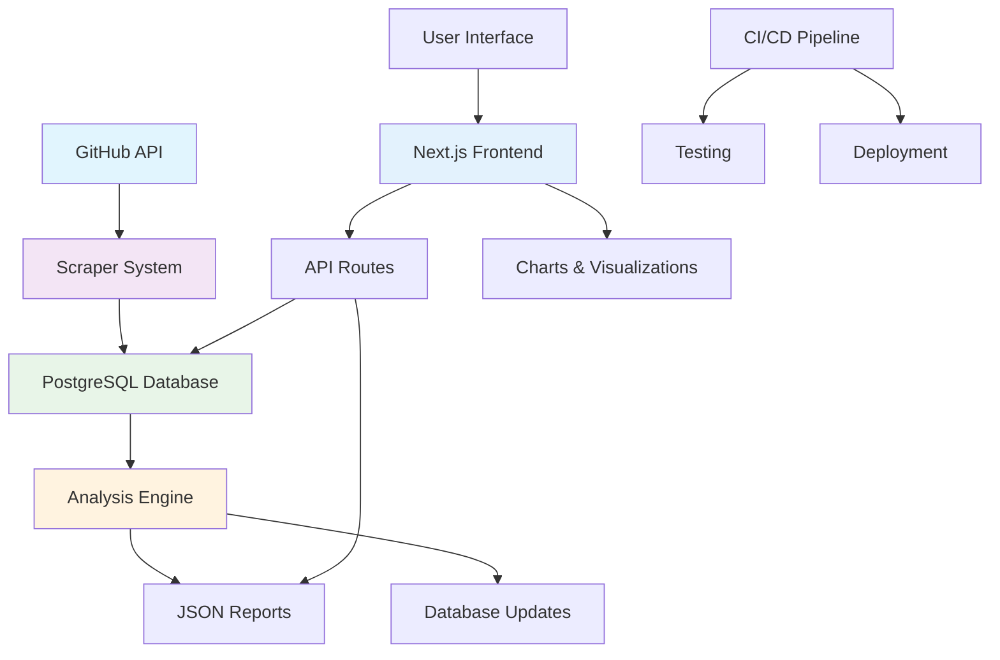

# 🏗️ GitHub Trending Scraper - 项目架构文档

## 📋 概述

GitHub Trending Scraper 是一个现代化的全栈项目，用于抓取、分析和可视化 GitHub 趋势数据。项目采用 **Next.js 14** + **TypeScript** 作为前端，**Python 3.12** 作为爬虫和数据分析引擎，**PostgreSQL** + **Prisma** 作为数据层。

### 🎯 核心特性
- 🕷️ **智能爬虫系统**：多 Token 管理、速率限制、错误恢复
- 📊 **数据分析引擎**：代码分析、趋势计算、库依赖分析
- 🎨 **现代化 UI**：响应式设计、暗色模式、实时图表
- 🧪 **完整测试体系**：前后端测试、CI/CD、覆盖率报告
- 🔧 **开发者友好**：自动化工具、详细文档、跨平台支持

## 🗂️ 优化后的目录结构

### 📁 当前结构问题
- 文档文件散乱在根目录
- 测试文件分布不统一
- 工具脚本缺乏组织
- 配置文件混杂

### 🎯 建议的新架构

```
github-trending-scraper/
├── 📁 docs/                          # 📚 项目文档
│   ├── ARCHITECTURE.md               # 架构文档
│   ├── API.md                        # API 文档
│   ├── TESTING.md                    # 测试指南
│   ├── QUICK_START.md                # 快速开始
│   ├── DEPLOYMENT.md                 # 部署指南
│   └── CONTRIBUTING.md               # 贡献指南
│
├── 📁 src/                           # 🎨 前端源码
│   ├── app/                          # Next.js App Router
│   │   ├── (dashboard)/              # 仪表盘路由组
│   │   │   ├── dashboard/
│   │   │   ├── keywords/
│   │   │   ├── daily/
│   │   │   ├── weekly/
│   │   │   └── monthly/
│   │   ├── api/                      # API 路由
│   │   │   ├── keywords/
│   │   │   ├── repositories/
│   │   │   ├── stats/
│   │   │   ├── trending/
│   │   │   └── analysis/
│   │   ├── globals.css
│   │   ├── layout.tsx
│   │   └── page.tsx
│   │
│   ├── components/                   # 🧩 UI 组件
│   │   ├── ui/                       # 基础 UI 组件
│   │   ├── charts/                   # 图表组件
│   │   │   ├── trends-chart.tsx
│   │   │   ├── language-chart.tsx
│   │   │   └── library-chart.tsx
│   │   ├── features/                 # 功能组件
│   │   │   ├── keyword-search/
│   │   │   ├── repository-list/
│   │   │   └── analytics-dashboard/
│   │   └── layout/                   # 布局组件
│   │       ├── navbar.tsx
│   │       └── sidebar.tsx
│   │
│   ├── lib/                          # 🛠️ 工具库
│   │   ├── db/                       # 数据库相关
│   │   │   ├── prisma.ts
│   │   │   └── queries.ts
│   │   ├── api/                      # API 工具
│   │   │   ├── client.ts
│   │   │   └── types.ts
│   │   ├── utils/                    # 通用工具
│   │   │   ├── format.ts
│   │   │   ├── validation.ts
│   │   │   └── constants.ts
│   │   └── python-resolver.ts
│   │
│   └── types/                        # 🏷️ TypeScript 类型
│       ├── api.ts
│       ├── database.ts
│       └── components.ts
│
├── 📁 backend/                       # 🐍 Python 后端
│   ├── scraper/                      # 爬虫系统
│   │   ├── core/                     # 核心模块
│   │   │   ├── __init__.py
│   │   │   ├── token_manager.py      # Token 管理
│   │   │   ├── api_client.py         # GitHub API 客户端
│   │   │   └── rate_limiter.py       # 速率限制
│   │   ├── crawlers/                 # 爬虫实现
│   │   │   ├── __init__.py
│   │   │   ├── keyword_crawler.py
│   │   │   └── repository_crawler.py
│   │   ├── analyzers/                # 分析器
│   │   │   ├── __init__.py
│   │   │   ├── code_analyzer.py
│   │   │   └── trend_analyzer.py
│   │   ├── utils/                    # 工具函数
│   │   │   ├── __init__.py
│   │   │   ├── database.py
│   │   │   └── helpers.py
│   │   └── main.py                   # 入口文件
│   │
│   ├── analysis/                     # 数据分析
│   │   ├── processors/               # 数据处理器
│   │   │   ├── __init__.py
│   │   │   ├── trend_processor.py
│   │   │   └── library_processor.py
│   │   ├── generators/               # 报告生成器
│   │   │   ├── __init__.py
│   │   │   ├── json_generator.py
│   │   │   └── chart_generator.py
│   │   └── main.py
│   │
│   ├── config/                       # 配置文件
│   │   ├── __init__.py
│   │   ├── settings.py
│   │   └── logging.py
│   │
│   ├── requirements/                 # 依赖管理
│   │   ├── base.txt                  # 基础依赖
│   │   ├── dev.txt                   # 开发依赖
│   │   └── test.txt                  # 测试依赖
│   │
│   └── pyproject.toml                # Python 项目配置
│
├── 📁 tests/                         # 🧪 测试文件
│   ├── frontend/                     # 前端测试
│   │   ├── __tests__/
│   │   │   ├── api/
│   │   │   ├── components/
│   │   │   └── utils/
│   │   ├── jest.config.js
│   │   └── jest.setup.js
│   │
│   ├── backend/                      # 后端测试
│   │   ├── unit/                     # 单元测试
│   │   ├── integration/              # 集成测试
│   │   ├── fixtures/                 # 测试数据
│   │   └── conftest.py               # pytest 配置
│   │
│   └── e2e/                          # 端到端测试
│       ├── specs/
│       └── playwright.config.ts
│
├── 📁 tools/                         # 🔧 开发工具
│   ├── scripts/                      # 脚本文件
│   │   ├── setup/                    # 环境设置
│   │   │   ├── install-deps.sh
│   │   │   ├── setup-db.sh
│   │   │   └── check-env.js
│   │   ├── testing/                  # 测试脚本
│   │   │   ├── run-tests.sh
│   │   │   ├── run-tests.bat
│   │   │   └── test-setup.js
│   │   ├── deployment/               # 部署脚本
│   │   │   ├── build.sh
│   │   │   └── deploy.sh
│   │   └── maintenance/              # 维护脚本
│   │       ├── clean-cache.js
│   │       └── backup-db.sh
│   │
│   ├── generators/                   # 代码生成器
│   │   ├── component-generator.js
│   │   └── api-generator.js
│   │
│   └── validators/                   # 验证工具
│       ├── schema-validator.js
│       └── env-validator.js
│
├── 📁 database/                      # 🗄️ 数据库
│   ├── prisma/
│   │   ├── schema.prisma
│   │   ├── migrations/
│   │   └── seed.ts
│   │
│   ├── backups/                      # 数据库备份
│   └── scripts/                      # 数据库脚本
│       ├── init.sql
│       └── cleanup.sql
│
├── 📁 public/                        # 📦 静态资源
│   ├── assets/                       # 资源文件
│   │   ├── images/
│   │   ├── icons/
│   │   └── fonts/
│   │
│   ├── data/                         # 静态数据
│   │   └── analytics/                # 分析结果
│   │
│   └── favicon.ico
│
├── 📁 config/                        # ⚙️ 配置文件
│   ├── next.config.js                # Next.js 配置
│   ├── tailwind.config.js            # Tailwind 配置
│   ├── tsconfig.json                 # TypeScript 配置
│   ├── eslint.config.js              # ESLint 配置
│   └── postcss.config.js             # PostCSS 配置
│
├── 📁 .github/                       # 🤖 GitHub 配置
│   ├── workflows/                    # GitHub Actions
│   │   ├── ci.yml
│   │   ├── codeql.yml
│   │   └── deploy.yml
│   ├── ISSUE_TEMPLATE/               # Issue 模板
│   ├── PULL_REQUEST_TEMPLATE.md      # PR 模板
│   └── dependabot.yml               # Dependabot 配置
│
├── 📄 README.md                      # 项目说明
├── 📄 CHANGELOG.md                   # 更新日志
├── 📄 LICENSE                        # 许可证
├── 📄 .env.example                   # 环境变量示例
├── 📄 .gitignore                     # Git 忽略文件
├── 📄 package.json                   # Node.js 依赖
└── 📄 docker-compose.yml             # Docker 配置
```

## 🔄 架构重构计划

### 📋 第一阶段：文档整理
- [ ] 创建 `docs/` 目录，迁移所有文档文件
- [ ] 整理 API 文档到 `docs/API.md`
- [ ] 创建部署指南 `docs/DEPLOYMENT.md`

### 📋 第二阶段：前端重构
- [ ] 创建 `src/` 目录，迁移前端代码
- [ ] 按功能组织组件到 `components/features/`
- [ ] 分离工具库到 `lib/` 子目录
- [ ] 统一类型定义到 `types/`

### 📋 第三阶段：后端重构
- [ ] 重命名 `scraper/` 为 `backend/`
- [ ] 按模块拆分爬虫代码
- [ ] 分离配置和依赖管理
- [ ] 优化 Python 包结构

### 📋 第四阶段：测试整合
- [ ] 统一测试到 `tests/` 目录
- [ ] 分离前后端测试配置
- [ ] 添加 E2E 测试框架

### 📋 第五阶段：工具优化
- [ ] 整理脚本到 `tools/scripts/`
- [ ] 按功能分类工具脚本
- [ ] 添加代码生成器

## 🏗️ 核心架构模式

### 🎨 前端架构
```
┌─────────────────┐    ┌─────────────────┐    ┌─────────────────┐
│   Presentation  │    │    Business     │    │      Data       │
│     Layer       │◄──►│     Logic       │◄──►│     Layer       │
│                 │    │     Layer       │    │                 │
│  • Components   │    │  • Hooks        │    │  • API Client   │
│  • Pages        │    │  • Utils        │    │  • Types        │
│  • Layouts      │    │  • Validators   │    │  • Queries      │
└─────────────────┘    └─────────────────┘    └─────────────────┘
```

### 🐍 后端架构
```
┌─────────────────┐    ┌─────────────────┐    ┌─────────────────┐
│    Scraper      │    │    Analysis     │    │    Database     │
│    System       │◄──►│    Engine       │◄──►│     Layer       │
│                 │    │                 │    │                 │
│  • Crawlers     │    │  • Processors   │    │  • Models       │
│  • Token Mgmt   │    │  • Generators   │    │  • Migrations   │
│  • Rate Limit   │    │  • Analyzers    │    │  • Queries      │
└─────────────────┘    └─────────────────┘    └─────────────────┘
```

## 📊 数据流架构



## 🔧 技术栈详解

### 🌐 前端技术栈
| 技术 | 版本 | 用途 | 配置文件 |
|------|------|------|----------|
| **Next.js** | 14.x | React 框架 | `next.config.js` |
| **TypeScript** | 5.x | 类型系统 | `tsconfig.json` |
| **Tailwind CSS** | 3.x | 样式框架 | `tailwind.config.js` |
| **Radix UI** | Latest | 组件库 | - |
| **Recharts** | 2.x | 图表库 | - |
| **Jest** | 29.x | 测试框架 | `jest.config.js` |

### 🐍 后端技术栈
| 技术 | 版本 | 用途 | 配置文件 |
|------|------|------|----------|
| **Python** | 3.12+ | 主语言 | `pyproject.toml` |
| **Requests** | Latest | HTTP 客户端 | `requirements.txt` |
| **BeautifulSoup** | 4.x | HTML 解析 | - |
| **psycopg2** | Latest | PostgreSQL 驱动 | - |
| **pytest** | 7.x | 测试框架 | `pyproject.toml` |
| **Black** | Latest | 代码格式化 | `pyproject.toml` |

### 🗄️ 数据库技术栈
| 技术 | 版本 | 用途 | 配置文件 |
|------|------|------|----------|
| **PostgreSQL** | 15+ | 主数据库 | - |
| **Prisma** | 5.x | ORM 工具 | `schema.prisma` |

## 🚀 部署架构

### 🌍 生产环境
```
┌─────────────────┐    ┌─────────────────┐    ┌─────────────────┐
│     Vercel      │    │   PostgreSQL    │    │   GitHub API    │
│   (Frontend)    │◄──►│   (Database)    │◄──►│   (Data Source) │
│                 │    │                 │    │                 │
│  • Next.js App  │    │  • Primary DB   │    │  • REST API     │
│  • Static Files │    │  • Backups      │    │  • Rate Limits  │
│  • API Routes   │    │  • Monitoring   │    │  • Auth Tokens  │
└─────────────────┘    └─────────────────┘    └─────────────────┘
         │                       │
         └───────────────────────┘
              Background Jobs
           (Python Scrapers)
```

### 🔄 CI/CD 流程
```
┌─────────────┐    ┌─────────────┐    ┌─────────────┐    ┌─────────────┐
│   Git Push  │───►│   GitHub    │───►│   Build &   │───►│   Deploy    │
│             │    │   Actions   │    │    Test     │    │             │
│  • Code     │    │             │    │             │    │  • Vercel   │
│  • Tests    │    │  • Lint     │    │  • Frontend │    │  • Database │
│  • Docs     │    │  • Test     │    │  • Backend  │    │  • Monitoring│
└─────────────┘    └─────────────┘    └─────────────┘    └─────────────┘
```

## 📈 性能优化策略

### 🎨 前端优化
- **代码分割**：按路由和组件懒加载
- **图片优化**：Next.js Image 组件
- **缓存策略**：SWR 数据缓存
- **Bundle 分析**：webpack-bundle-analyzer

### 🐍 后端优化
- **连接池**：数据库连接复用
- **批量处理**：减少 API 调用次数
- **缓存机制**：Redis 缓存热点数据
- **异步处理**：并发爬取和分析

### 🗄️ 数据库优化
- **索引优化**：关键字段索引
- **查询优化**：避免 N+1 查询
- **分页策略**：游标分页
- **数据归档**：历史数据清理

## 🔒 安全考虑

### 🛡️ 前端安全
- **CSP 策略**：内容安全策略
- **XSS 防护**：输入验证和转义
- **CSRF 防护**：Token 验证
- **环境变量**：敏感信息保护

### 🔐 后端安全
- **Token 管理**：安全存储和轮换
- **速率限制**：防止 API 滥用
- **输入验证**：数据清洗和验证
- **日志审计**：操作记录和监控

## 📚 开发指南

### 🎯 代码规范
- **命名约定**：驼峰命名、语义化
- **文件组织**：按功能分组
- **注释规范**：JSDoc 和 docstring
- **提交规范**：Conventional Commits

### 🧪 测试策略
- **单元测试**：核心逻辑覆盖
- **集成测试**：API 和数据库
- **E2E 测试**：关键用户流程
- **覆盖率目标**：70%+

### 📖 文档维护
- **API 文档**：自动生成和更新
- **组件文档**：Storybook 展示
- **架构图**：Mermaid 图表
- **更新日志**：版本变更记录