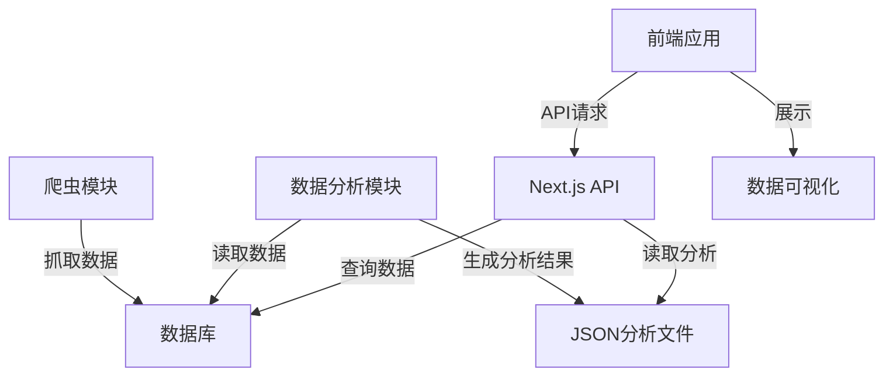

# (本项目全文为AI生成，仅作为学习参考使用，侵删）

# GitHub趋势爬虫

一个用于抓取和分析GitHub趋势数据的系统，提供数据可视化和趋势分析功能。

## 项目概述

该项目通过爬虫自动抓取GitHub上各种关键词相关的仓库，分析它们的代码、语言分布、使用的库/包等信息，生成分析报告和可视化图表。系统包括爬虫、数据分析和前端展示三个主要部分。

### 主要特性

- 自动抓取GitHub仓库数据
- 分析代码文件和使用的库/包
- 生成趋势图表和分析报告
- 交互式数据可视化
- 支持按关键词和语言筛选

## 项目结构

```
github-trend-crawler/
├── app/                   # Next.js应用程序目录
├── components/            # 共享UI组件
├── lib/                   # 工具库和共享函数
├── public/                # 静态资源
│   └── analytics/         # 分析数据文件
├── prisma/                # Prisma数据库模型
├── scraper/               # 爬虫代码
├── analysis/              # 数据分析代码
└── tools/                 # 工具和脚本
```

有关项目架构的详细说明，请参阅 [ARCHITECTURE.md](ARCHITECTURE.md)。

## 安装

### 前提条件

- Node.js (16.x 或更高版本)
- Python 3.8+
- PostgreSQL 12+

### 安装步骤

1. 克隆仓库
   ```bash
   git clone https://github.com/your-username/github-trend-crawler.git
   cd github-trend-crawler
   ```

2. 安装前端依赖
   ```bash
   npm install
   ```

3. 安装Python依赖
   ```bash
   pip install -r requirements.txt
   ```

4. 配置环境变量
   - 复制`.env.example`为`.env`
   - 填写必要的环境变量，包括数据库连接信息

5. 初始化数据库
   ```bash
   npx prisma db push
   ```

## 使用方法

### 启动开发服务器

```bash
npm run dev
```

### 运行爬虫

```bash
python scraper/crawler.py --keyword "机器学习"
```

### 生成分析数据

```bash
python analysis/data_analysis.py --keyword "机器学习"
```

### 生成趋势数据

```bash
python analysis/analyze_trends.py
```

### 构建生产版本

```bash
npm run build
npm start
```

## 工具和脚本

项目包含多个实用工具脚本，位于`tools/`目录：

- **clean_analytics.py**: 清理临时文件和旧分析数据
  ```bash
  python tools/clean_analytics.py
  ```

- **regenerate_analytics.py**: 重新生成分析数据
  ```bash
  python tools/regenerate_analytics.py
  ```

## API参考

系统提供以下主要API:

- `/api/trends`: 获取趋势数据
- `/api/keywords`: 管理关键词
- `/api/repositories`: 获取仓库数据
- `/api/libraries`: 获取库分析数据
- `/api/crawl`: 控制爬虫任务

有关API详细用法，请参考API文档。

## 开发指南

### 添加新的关键词

1. 通过管理界面添加
2. 或直接插入数据库:
   ```sql
   INSERT INTO keywords (text, created_at) VALUES ('新关键词', NOW());
   ```

### 添加新的分析图表

1. 在`components/`目录下创建新的图表组件
2. 更新相关页面引用该组件
3. 如需新的数据格式，更新数据分析模块

### 修改爬虫逻辑

爬虫代码位于`scraper/`目录，主要文件:

- `crawler.py`: 爬虫主程序
- `code_analysis.py`: 代码分析

## 贡献指南

欢迎贡献代码、报告问题或提出改进建议！

1. Fork本仓库
2. 创建您的功能分支 (`git checkout -b feature/amazing-feature`)
3. 提交您的更改 (`git commit -m 'Add some amazing feature'`)
4. 推送到分支 (`git push origin feature/amazing-feature`)
5. 打开Pull Request

## 许可证

本项目采用MIT许可证 - 详情请参阅[LICENSE](LICENSE)文件。

## 项目清理

项目版本迭代过程中，以下文件已被整合或移除：

- 根目录的`analyze_trends.py`已移除，请使用`analysis/analyze_trends.py`
- `/app/api/analytics/route.ts`已合并到`/app/api/analysis/route.ts`

# 更新为：

<div align="center">
  
  <h1>✨ GitHub趋势爬虫与分析平台 ✨</h1>
  <p><strong>探索GitHub热门项目，挖掘编程语言与开源趋势</strong></p>

  <p>
    <a href="#功能特性">功能特性</a> •
    <a href="#技术架构">技术架构</a> •
    <a href="#界面展示">界面展示</a> •
    <a href="#快速开始">快速开始</a> •
    <a href="#使用指南">使用指南</a> •
    <a href="#开发文档">开发文档</a>
  </p>
</div>

## 🌟 项目介绍

GitHub趋势爬虫与分析平台是一个全栈应用程序，自动抓取GitHub上热门仓库的数据，并通过先进的数据可视化技术呈现开源社区的发展趋势。系统支持多种编程语言的数据分析，帮助开发者洞察技术潮流，发现优质项目。

<div align="center">
  
</div>

## ✨ 功能特性

- **📊 实时数据仪表盘** - 展示项目总数、星标总数、语言分布等关键指标
- **🔍 关键词分析** - 按技术关键词抓取并分析GitHub仓库
- **📈 趋势可视化** - 多维度图表展示开源项目发展趋势
- **🧩 语言分布分析** - 直观展示不同编程语言的流行度和使用情况
- **📚 库与依赖分析** - 分析项目中使用的热门库和框架
- **🔄 自动化爬虫** - 支持定时任务，保持数据更新
- **🎨 现代UI设计** - 渐变背景与毛玻璃效果，提供出色的视觉体验

## 🛠️ 技术架构

<div align="center">
  <table>
    <tr>
      <th>前端</th>
      <th>后端</th>
      <th>数据库</th>
      <th>爬虫</th>
    </tr>
    <tr>
      <td>
        <ul>
          <li>Next.js 13</li>
          <li>React</li>
          <li>TypeScript</li>
          <li>TailwindCSS</li>
          <li>Shadcn UI</li>
          <li>Recharts</li>
        </ul>
      </td>
      <td>
        <ul>
          <li>Next.js API Routes</li>
          <li>Python</li>
          <li>FastAPI</li>
        </ul>
      </td>
      <td>
        <ul>
          <li>PostgreSQL</li>
          <li>Prisma ORM</li>
        </ul>
      </td>
      <td>
        <ul>
          <li>Python</li>
          <li>BeautifulSoup</li>
          <li>Requests</li>
          <li>GitHub API</li>
        </ul>
      </td>
    </tr>
  </table>
</div>

### 系统架构图



## 🖥️ 界面展示

<div align="center" style="display: flex; flex-wrap: wrap; gap: 20px; justify-content: center;">
  <div style="flex: 1; min-width: 300px; max-width: 400px;">
    <p><strong>首页仪表盘</strong></p>
    
  </div>
  <div style="flex: 1; min-width: 300px; max-width: 400px;">
    <p><strong>关键词分析</strong></p>
    
  </div>
</div>
<div align="center" style="display: flex; flex-wrap: wrap; gap: 20px; justify-content: center; margin-top: 20px;">
  <div style="flex: 1; min-width: 300px; max-width: 400px;">
    <p><strong>语言分布</strong></p>
    
  </div>
  <div style="flex: 1; min-width: 300px; max-width: 400px;">
    <p><strong>月度趋势</strong></p>
    
  </div>
</div>

## 🚀 快速开始

### 前提条件

- Node.js (16.x 或更高版本)
- Python 3.8+
- PostgreSQL 12+

### 安装步骤

1. **克隆仓库**
   ```bash
   git clone https://github.com/your-username/github-trend-crawler.git
   cd github-trend-crawler
   ```

2. **安装依赖**
   ```bash
   # 安装前端依赖
   npm install
   
   # 安装Python依赖
   pip install -r requirements.txt
   ```

3. **配置环境**
   ```bash
   # 复制环境变量示例文件
   cp .env.example .env
   
   # 编辑.env文件，设置数据库连接信息和GitHub API令牌
   ```

4. **初始化数据库**
   ```bash
   npx prisma db push
   ```

5. **启动应用**
   ```bash
   npm run dev
   ```

   现在可以访问 http://localhost:3000 查看应用

## 📖 使用指南

### 爬取GitHub数据

1. 在首页或关键词页面输入想要分析的关键词
2. 选择需要爬取的编程语言和数量
3. 点击"搜索并分析"按钮开始爬取
4. 系统会在后台处理数据，完成后自动生成分析结果

### 查看分析结果

- **首页仪表盘**：查看总体统计数据和趋势
- **关键词分析**：查看特定关键词的详细分析
  - 概览：语言分布、星标统计等基本信息
  - 项目列表：查看所有爬取的仓库
  - 库分析：分析项目中使用的库和依赖
  - 关键词分析：深入分析描述和标签

### 自定义分析

可以通过Python脚本自定义分析：

```bash
# 分析特定关键词
python analysis/data_analysis.py --keyword "机器学习" --detailed

# 生成月度趋势数据
python analysis/analyze_trends.py --period monthly --languages python,javascript
```

## 📝 开发文档

### 项目结构

```
github-trend-crawler/
├── app/                   # Next.js应用程序目录
│   ├── api/               # API路由
│   ├── (routes)/          # 页面路由
│   └── components/        # 页面级组件
├── components/            # 共享UI组件
├── lib/                   # 工具库和共享函数
├── public/                # 静态资源
├── prisma/                # Prisma数据库模型
├── scraper/               # 爬虫代码
└── analysis/              # 数据分析代码
```

### 核心模块

- **爬虫系统**: 负责从GitHub抓取仓库数据
- **数据分析**: 处理原始数据，生成分析结果
- **API系统**: 提供数据接口，连接前后端
- **前端UI**: 展示数据可视化和用户交互

### API参考

| 端点 | 描述 | 方法 |
|------|------|------|
| `/api/stats` | 获取总体统计数据 | GET |
| `/api/keywords` | 管理关键词 | GET, POST |
| `/api/trending` | 获取趋势数据 | GET |
| `/api/repositories` | 查询仓库数据 | GET |
| `/api/crawl` | 控制爬虫任务 | POST |

详细API文档请参见 [API文档](./API.md)

## 🎨 UI设计

最新版本采用现代UI设计：

- **渐变背景**：柔和的蓝紫色渐变，提供舒适的视觉体验
- **毛玻璃效果**：卡片组件采用磨砂玻璃设计，增强层次感
- **响应式布局**：完美适配桌面和移动设备
- **暗色模式**：支持深色主题，减轻视觉疲劳

## 📄 许可证

本项目采用MIT许可证 - 详情请参阅[LICENSE](LICENSE)文件。

## 🤝 贡献

欢迎贡献代码、报告问题或提出改进建议！请查看[贡献指南](CONTRIBUTING.md)了解详情。

---

<div align="center">
  <p>用❤️打造 | 基于Next.js, Python和PostgreSQL</p>
  <p>© 2023 GitHub趋势爬虫团队</p>
</div>
