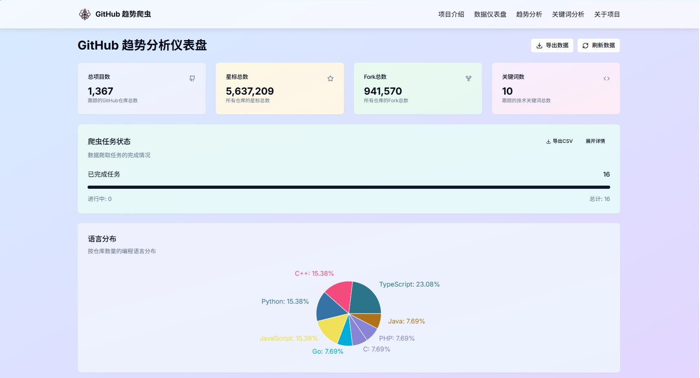
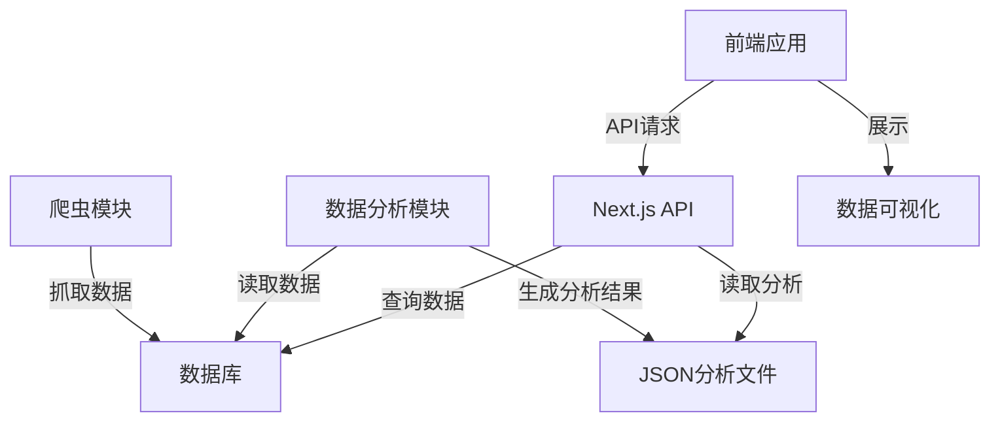
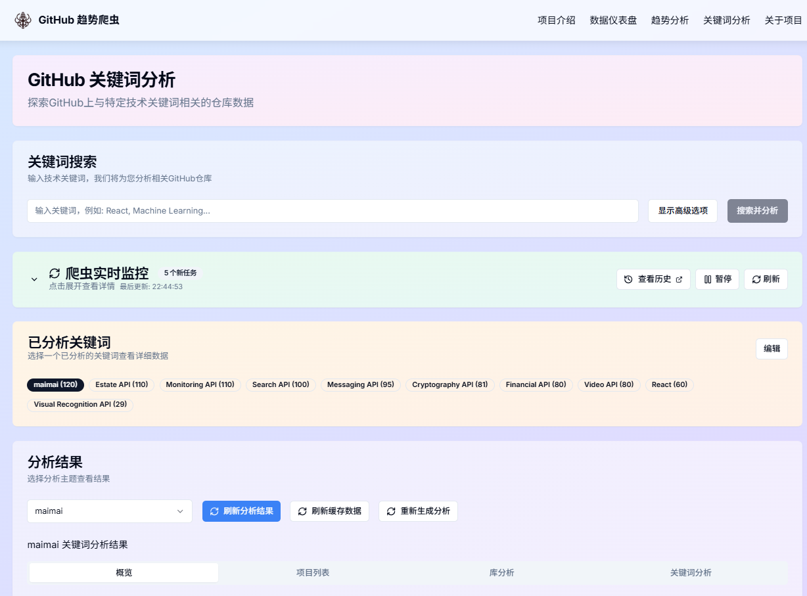
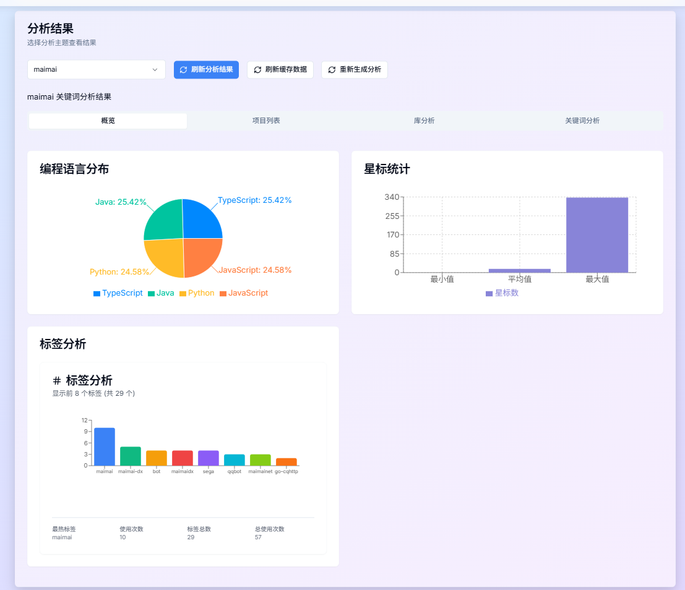
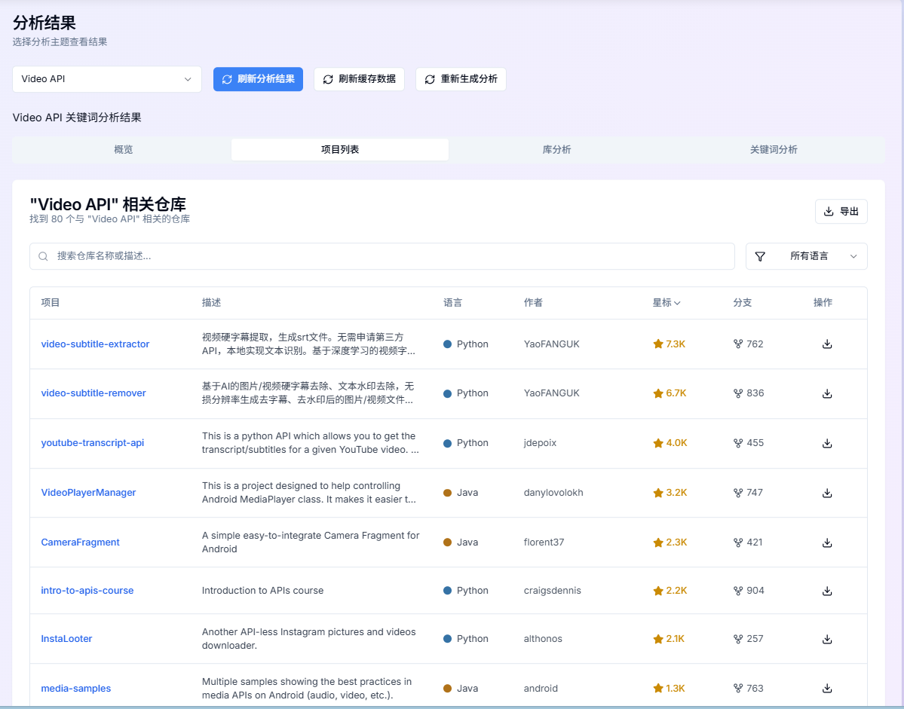
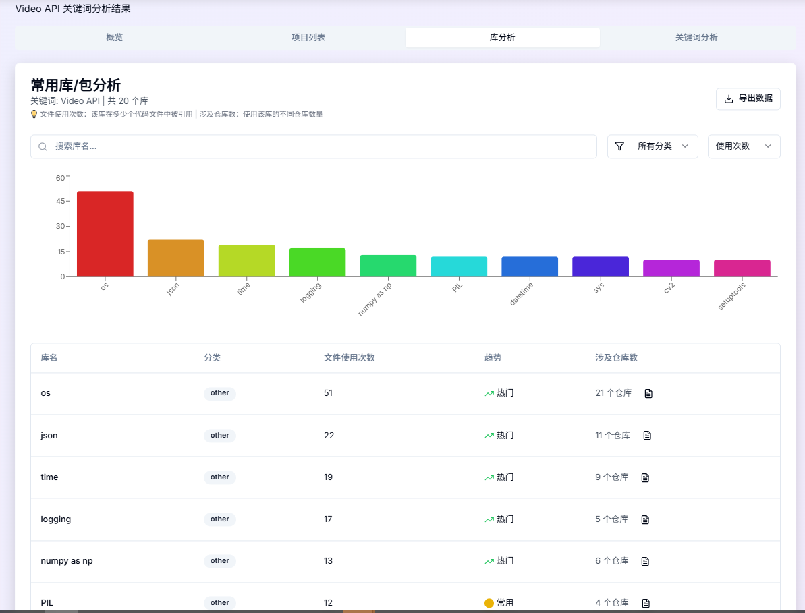
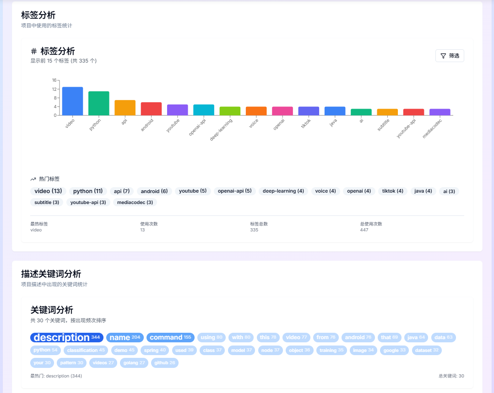
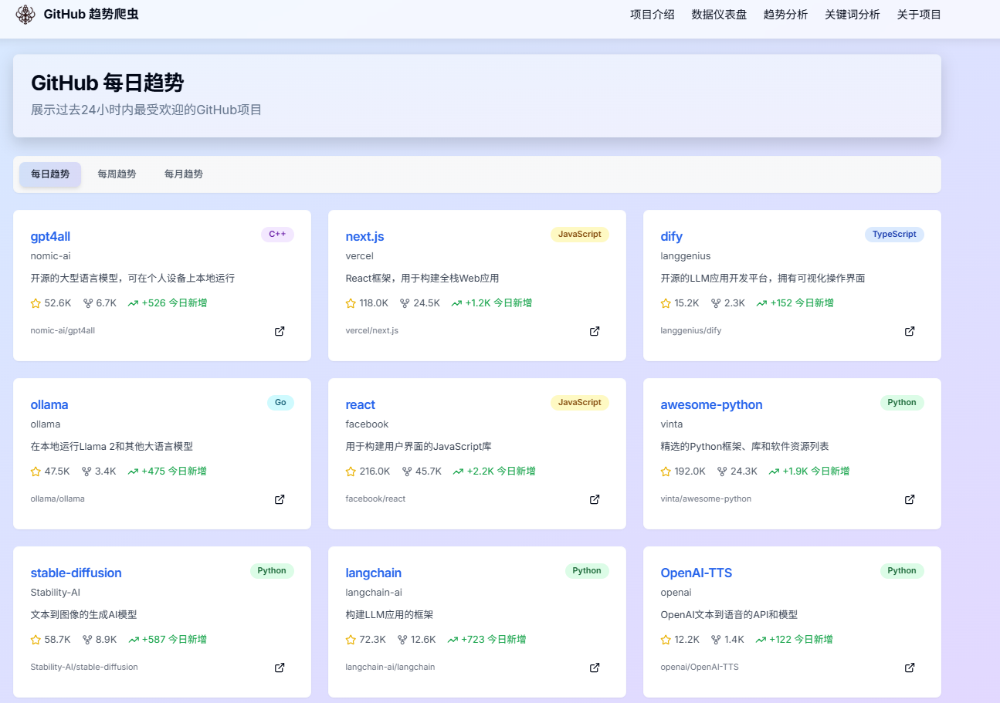
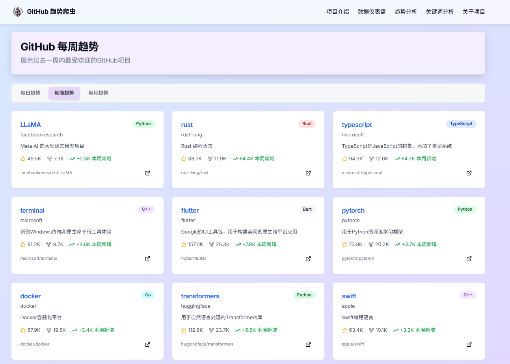
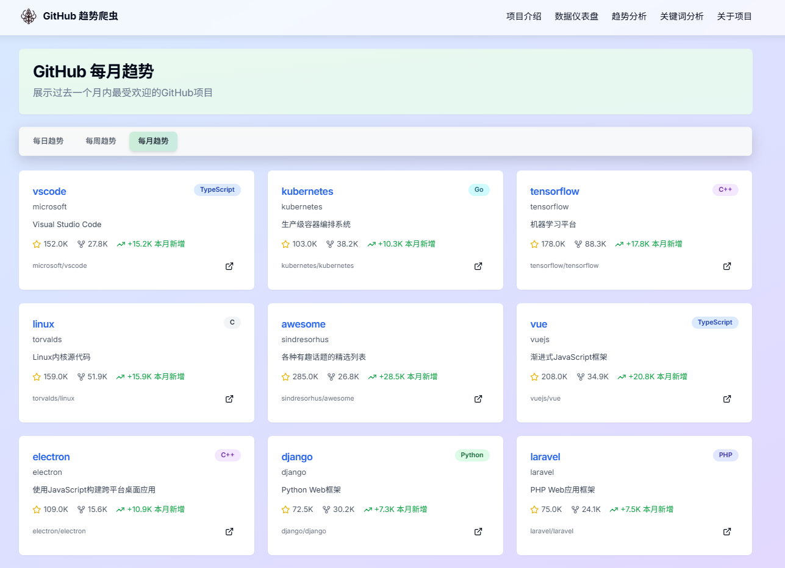

<div align="center">
  
  <h1> GitHub趋势爬虫与分析平台 </h1>
  <p><strong>探索GitHub热门项目，挖掘编程语言与开源趋势</strong></p>

  <p>
    <a href="#功能特性">功能特性</a> •
    <a href="#技术架构">技术架构</a> •
    <a href="#界面展示">界面展示</a> •
    <a href="#快速开始">快速开始</a> •
    <a href="#使用指南">使用指南</a> •
    <a href="#开发文档">开发文档</a>
  </p>
</div>

## 🌟 项目介绍

GitHub趋势爬虫与分析平台是一个全栈应用程序，自动抓取GitHub上热门仓库的数据，并通过先进的数据可视化技术呈现开源社区的发展趋势。系统支持多种编程语言的数据分析，帮助开发者洞察技术潮流，发现优质项目。

<div align="center">
  
</div>

## ✨ 功能特性

- **📊 实时数据仪表盘** - 展示项目总数、星标总数、语言分布等关键指标
- **🔍 关键词分析** - 按技术关键词抓取并分析GitHub仓库
- **📈 趋势可视化** - 多维度图表展示开源项目发展趋势
- **🧩 语言分布分析** - 直观展示不同编程语言的流行度和使用情况
- **📚 库与依赖分析** - 分析项目中使用的热门库和框架
- **🔄 自动化爬虫** - 支持定时任务，保持数据更新
- **🎨 现代UI设计** - 渐变背景与毛玻璃效果，提供出色的视觉体验

## 🛠️ 技术架构

<div align="center">
  <table>
    <tr>
      <th>前端</th>
      <th>后端</th>
      <th>数据库</th>
      <th>爬虫</th>
    </tr>
    <tr>
      <td>
        <ul>
          <li>Next.js 13.5.6</li>
          <li>React 18</li>
          <li>TypeScript</li>
          <li>TailwindCSS</li>
          <li>Shadcn/ui</li>
          <li>Recharts</li>
          <li>Lucide React</li>
        </ul>
      </td>
      <td>
        <ul>
          <li>Next.js API Routes</li>
          <li>Python 3.8+</li>
          <li>Requests</li>
          <li>aiohttp</li>
          <li>Pandas</li>
        </ul>
      </td>
      <td>
        <ul>
          <li>PostgreSQL</li>
          <li>Prisma ORM</li>
          <li>psycopg2</li>
        </ul>
      </td>
      <td>
        <ul>
          <li>Python</li>
          <li>BeautifulSoup4</li>
          <li>Requests</li>
          <li>GitHub REST API</li>
          <li>Token 管理</li>
        </ul>
      </td>
    </tr>
  </table>
</div>

### 系统架构图



## 🖥️ 界面展示

<div align="center" style="display: flex; flex-wrap: wrap; gap: 20px; justify-content: center;">
  <div style="flex: 1; min-width: 300px; max-width: 400px;">
    <p><strong>首页仪表盘</strong></p>
    
  </div>
  <div style="flex: 1; min-width: 300px; max-width: 400px;">
    <p><strong>关键词总览</strong></p>
    
  </div>
</div>
<div align="center" style="display: flex; flex-wrap: wrap; gap: 20px; justify-content: center; margin-top: 20px;">
  <div style="flex: 1; min-width: 300px; max-width: 400px;">
    <p><strong>关键词详细分析</strong></p>
    
  </div>
  <div style="flex: 1; min-width: 300px; max-width: 400px;">
    <p><strong>数据可视化</strong></p>
    
  </div>
</div>

<div align="center" style="display: flex; flex-wrap: wrap; gap: 20px; justify-content: center; margin-top: 20px;">
  <div style="flex: 1; min-width: 300px; max-width: 400px;">
    <p><strong>库分析与趋势</strong></p>
    
  </div>
  <div style="flex: 1; min-width: 300px; max-width: 400px;">
    <p><strong>标签分析</strong></p>
    
  </div>
</div>

<div align="center" style="display: flex; flex-wrap: wrap; gap: 20px; justify-content: center; margin-top: 20px;">
  <div style="flex: 1; min-width: 300px; max-width: 400px;">
    <p><strong>日趋势分析</strong></p>
    
  </div>
  <div style="flex: 1; min-width: 300px; max-width: 400px;">
    <p><strong>周趋势分析</strong></p>
    
  </div>
</div>

<div align="center" style="margin-top: 20px;">
  <div style="max-width: 400px;">
    <p><strong>月趋势分析</strong></p>
    
  </div>
</div>

## 🚀 快速开始

### 环境要求

- Node.js 18+
- Python 3.8+
- PostgreSQL 数据库

### 安装步骤

1. **克隆仓库**
   ```bash
   git clone https://github.com/AiNiJou1337/SpiderGit.git
   cd SpiderGit
   ```

2. **安装依赖**
   ```bash
   # 前端依赖
   npm install

   # Python 依赖
   pip install -r backend/requirements/base.txt

   # 开发和测试依赖（可选）
   pip install -r backend/requirements/dev.txt
   ```

3. **配置环境**
   ```bash
   # 复制环境变量示例文件
   cp .env.example .env

   # 编辑 .env 文件，至少设置：
   # - DATABASE_URL（PostgreSQL 连接）
   # - 可选：GITHUB_TOKEN_MAIN（GitHub API Token，用于更高速率）
   # - 可选：GITHUB_TOKEN_BACKUP1, GITHUB_TOKEN_BACKUP2（备用 Token）
   ```

4. **初始化数据库**
   ```bash
   # 使用 Prisma 初始化数据库
   npm run prisma:push
   npm run prisma:generate

   # 可选：填充种子数据
   npm run prisma:seed
   ```

5. **启动应用**
   ```bash
   npm run dev
   ```

   可以访问 http://localhost:3000 查看应用

## 📖 使用指南

### 爬取GitHub数据

1. 在首页或关键词页面输入想要分析的关键词
2. 选择需要爬取的编程语言和数量
3. 点击"搜索并分析"按钮开始爬取
4. 系统会在后台处理数据，完成后自动生成分析结果

### 查看分析结果

- **首页仪表盘**：查看总体统计数据和趋势
- **关键词分析**：查看特定关键词的详细分析
  - 概览：语言分布、星标统计等基本信息
  - 项目列表：查看所有爬取的仓库
  - 库分析：分析项目中使用的库和依赖
  - 关键词分析：深入分析描述和标签

### 自定义分析

可以通过Python脚本自定义分析：

```bash
# 进入后端目录
cd backend

# 运行关键词爬虫
python -m scraper.keyword_scraper

# 运行数据分析
python -m scraper.analyzers.data_analysis

# 运行完整的爬虫流程
python -m scraper.main

# 启动定时任务调度器
python -m scraper.scheduler
```

## 📝 开发文档

### 项目结构

```
SpiderGit/
├── app/                   # Next.js App Router 页面
│   ├── api/               # API 路由端点
│   ├── dashboard/         # 仪表盘页面
│   ├── keywords/          # 关键词分析页面
│   ├── daily/             # 日趋势页面
│   ├── weekly/            # 周趋势页面
│   └── monthly/           # 月趋势页面
├── src/                   # 前端源码
│   ├── components/        # React 组件
│   ├── lib/               # 工具库和共享函数
│   └── types/             # TypeScript 类型定义
├── backend/               # Python 后端
│   ├── scraper/           # 爬虫系统
│   │   ├── analyzers/     # 数据分析器
│   │   ├── core/          # 核心功能
│   │   └── crawlers/      # 爬虫实现
│   └── requirements/      # Python 依赖
├── database/              # 数据库配置
│   └── prisma/            # Prisma 模式和迁移
├── public/                # 静态资源
│   ├── analytics/         # 分析结果数据
│   └── img/               # 界面截图
├── docs/                  # 项目文档
├── tests/                 # 测试文件
└── tools/                 # 工具脚本
```

### 核心模块

- **爬虫系统**: 负责从GitHub抓取仓库数据
- **数据分析**: 处理原始数据，生成分析结果
- **API系统**: 提供数据接口，连接前后端
- **前端UI**: 展示数据可视化和用户交互

### API参考

| 端点                  | 描述 | 方法 |
|---------------------|------|------|
| `/api/stats`        | 获取总体统计数据 | GET |
| `/api/keywords`     | 管理关键词 | GET, POST |
| `/api/keywords/[id]` | 获取关键词详情 | GET |
| `/api/trending`     | 获取趋势数据 | GET |
| `/api/repositories` | 查询仓库数据 | GET |
| `/api/libraries`    | 获取库分析数据 | GET |
| `/api/analysis`     | 数据分析接口 | GET, POST |
| `/api/crawl`        | 控制爬虫任务 | POST |
| `/api/export`       | 数据导出接口 | GET |

详细API文档请参见 [架构文档](./docs/ARCHITECTURE.md)

## 🧪 测试

项目包含完整的前后端测试体系，确保代码质量和功能稳定性。

### 快速测试

```bash
# 运行所有测试
npm run test:all

# 仅运行前端测试
npm run test:frontend

# 仅运行后端测试
npm run test:backend

# 生成覆盖率报告
npm run test:coverage

# 代码质量检查
npm run ci:check
```

### 测试覆盖

- ✅ **前端测试**：API 路由、组件渲染、用户交互
- ✅ **后端测试**：爬虫逻辑、数据处理、Token 管理
- ✅ **集成测试**：数据库操作、API 集成
- ✅ **代码质量**：ESLint、TypeScript、Flake8、Black
- ✅ **自动化**：GitHub Actions CI/CD

详细测试指南请参见 [测试文档](./docs/TESTING.md)

### CI/CD 状态

项目配置了 GitHub Actions 自动化流程：

- 🔍 **代码质量检查**：ESLint、TypeScript、Flake8
- 🧪 **自动化测试**：前端和后端测试套件
- 🔒 **安全扫描**：依赖漏洞检测
- 📊 **覆盖率报告**：测试覆盖率统计

## 🎨 UI设计

最新版本采用现代UI设计：

- **渐变背景**：柔和的蓝紫色渐变，提供舒适的视觉体验
- **毛玻璃效果**：卡片组件采用磨砂玻璃设计，增强层次感
- **响应式布局**：完美适配桌面和移动设备
- **暗色模式**：支持深色主题，减轻视觉疲劳

## 📄 许可证

本项目采用MIT许可证 - 详情请参阅[LICENSE](LICENSE)文件。

## 🤝 贡献

欢迎贡献代码、报告问题或提出改进建议！

### 贡献方式
- 🐛 报告Bug：在Issues中提交问题报告
- 💡 功能建议：提出新功能或改进建议
- 📝 文档改进：完善项目文档
- 🔧 代码贡献：提交Pull Request

### 开发指南
1. Fork 项目仓库
2. 创建功能分支：`git checkout -b feature/amazing-feature`
3. 提交更改：`git commit -m 'Add amazing feature'`
4. 推送分支：`git push origin feature/amazing-feature`
5. 创建Pull Request

详细贡献指南请参见 [架构文档](./docs/ARCHITECTURE.md)

---

<div align="center">
  <p>用❤️打造 | 基于Next.js, Python和PostgreSQL</p>
  <p>© 2024 GitHub趋势爬虫团队</p>
</div>
