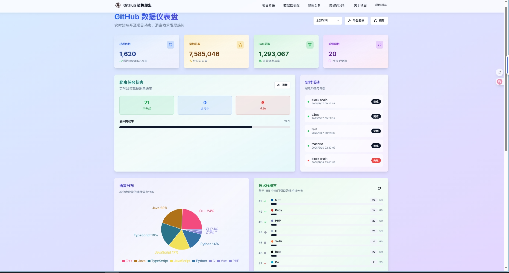
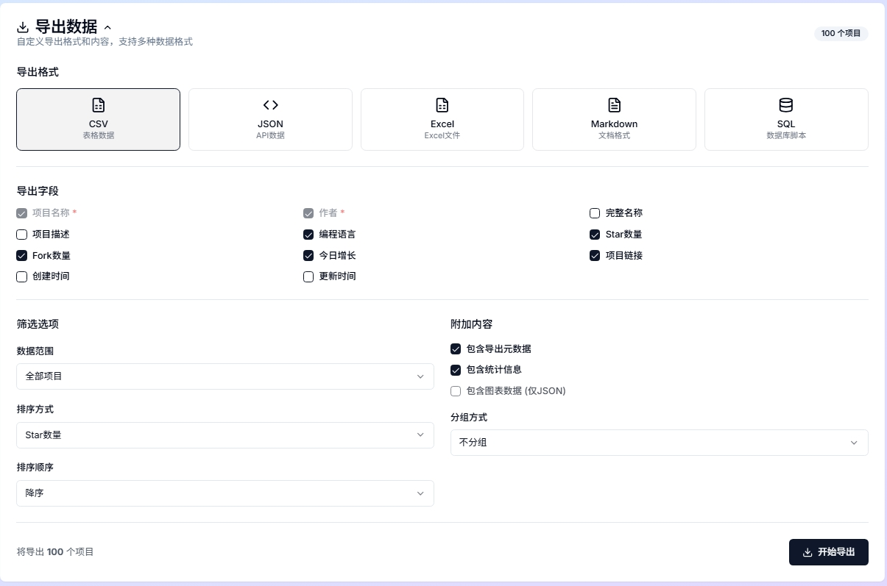
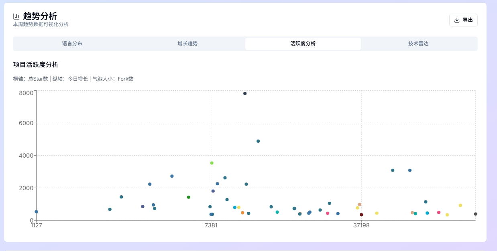

<div align="center">
  
  <h1>GitHub趋势爬虫与分析平台</h1>
  <p><strong>智能化的GitHub数据采集与分析平台，为开发者提供数据驱动的技术洞察</strong></p>

  <p>
    <a href="#功能特性">功能特性</a> •
    <a href="#技术架构">技术架构</a> •
    <a href="#界面展示">界面展示</a> •
    <a href="#快速开始">快速开始</a> •
    <a href="#使用指南">使用指南</a> •
    <a href="#开发文档">开发文档</a>
  </p>
</div>

## 🌟 项目介绍

GitHub趋势爬虫与分析平台是一个现代化的全栈应用程序，专注于自动抓取和分析GitHub上的热门仓库数据。通过智能爬虫系统和先进的数据可视化技术，为开发者提供全面的开源社区趋势洞察。


## ✨ 功能特性

### 🏠 Dashboard 仪表盘
- **📊 热门仓库展示** - 实时显示GitHub月度热门项目，按星标增长排序
- **📈 技术栈概览** - 可视化展示编程语言分布和趋势变化
- **🔥 趋势分析** - 多时间维度（日/周/月）的项目趋势追踪
- **📋 数据统计** - 项目总数、语言种类、活跃度等关键指标

### 🔍 数据采集与分析
- **🤖 智能爬虫系统** - 自动抓取GitHub Trending页面数据
- **🔄 多源数据整合** - 结合GitHub API和HTML解析，确保数据完整性
- **⏰ 时间序列存储** - 支持历史数据追踪和趋势分析
- **🎯 精准过滤** - 支持按编程语言、时间周期等维度筛选

### 🎨 用户体验
- **🌈 现代化UI设计** - 采用渐变背景和毛玻璃效果
- **📱 响应式布局** - 完美适配桌面和移动设备
- **⚡ 快速加载** - 优化的数据结构和缓存策略
- **🔧 实时刷新** - 支持手动刷新和自动更新

## 🛠️ 技术架构

<div align="center">
  <table>
    <tr>
      <th>前端</th>
      <th>后端</th>
      <th>数据库</th>
      <th>爬虫</th>
    </tr>
    <tr>
      <td>
        <ul>
          <li>Next.js 13.5.6</li>
          <li>React 18</li>
          <li>TypeScript</li>
          <li>TailwindCSS</li>
          <li>Shadcn/ui</li>
          <li>Recharts</li>
          <li>Lucide React</li>
        </ul>
      </td>
      <td>
        <ul>
          <li>Next.js API Routes</li>
          <li>Python 3.8+</li>
          <li>Requests</li>
          <li>aiohttp</li>
          <li>Pandas</li>
        </ul>
      </td>
      <td>
        <ul>
          <li>PostgreSQL</li>
          <li>Prisma ORM</li>
          <li>psycopg2</li>
        </ul>
      </td>
      <td>
        <ul>
          <li>Python</li>
          <li>BeautifulSoup4</li>
          <li>Requests</li>
          <li>GitHub REST API</li>
          <li>Token 管理</li>
        </ul>
      </td>
    </tr>
  </table>
</div>

### 系统架构图


## 🖥️ 界面展示 

<div align="center" style="display: flex; flex-wrap: wrap; gap: 20px; justify-content: center;">
<div align="center" style="margin-top: 20px;">
    <p><strong>数据仪表盘</strong></p>
    
  </div>


<div align="center" style="margin-top: 20px;">
    <p><strong>关键词总览</strong></p>
    
  </div>


<div align="center" style="margin-top: 20px;">
    <p><strong>分析结果总览</strong></p>
    
  </div>


<div align="center" style="margin-top: 20px;">
    <p><strong>数据可视化</strong></p>
    
  </div>


  <!-- 库分析与趋势 -->
<div align="center" style="margin-top: 20px;">
    <p><strong>库分析与趋势</strong></p>
    
  </div>


<div align="center" style="margin-top: 20px;">
    <p><strong>标签分析</strong></p>
    
  </div>


<div align="center" style="margin-top: 20px;">
    <p><strong>趋势分析总览</strong></p>
    
  </div>


  <!-- 导出数据 -->
<div align="center" style="margin-top: 20px;">
    <p><strong>导出数据</strong></p>
    
  </div>


</div>

<!-- 单列展示部分 -->
<div align="center" style="margin-top: 20px;">
  <div style="max-width: 400px;">
    <p><strong>分析列表展示</strong></p>
    
  </div>
</div>

<div align="center" style="margin-top: 20px;">
  <div style="max-width: 400px;">
    <p><strong>分析队列展示</strong></p>
    
  </div>
</div>

<div align="center" style="margin-top: 20px;">
  <div style="max-width: 400px;">
    <p><strong>尾部分页展示</strong></p>
    
  </div>
</div>

<div align="center" style="margin-top: 20px;">
  <div style="max-width: 400px;">
    <p><strong>增长趋势展示</strong></p>
    
  </div>
</div>

<div align="center" style="margin-top: 20px;">
  <div style="max-width: 400px;">
    <p><strong>活跃度分析展示</strong></p>
    
  </div>
</div>

<div align="center" style="margin-top: 20px;">
  <div style="max-width: 400px;">
    <p><strong>技术栈雷达展示</strong></p>
    
  </div>
</div>


## 🚀 快速开始

### 🔧 环境要求

- **Node.js**: 18+ (推荐 20+)
- **Python**: 3.8+ (推荐 3.9+)
- **GitHub Token**: Personal Access Token (用于API访问)
- **内存**: 建议 4GB+ 可用内存
- **存储**: 建议 1GB+ 可用空间

### 📥 安装步骤

#### 1. 克隆项目
```bash
git clone https://github.com/AiNiJou1337/SpiderGit.git
cd SpiderGit
```

#### 2. 前端环境配置
```bash
# 安装前端依赖
npm install

# 验证安装
npm run build
```

#### 3. 后端环境配置
```bash
# 进入后端目录
cd backend

# 安装Python依赖
pip install -r requirements/base.txt

# 验证安装
python -c "import requests, bs4; print('✅ 依赖安装成功')"
```

#### 4. GitHub Token配置
创建项目根目录下的 `.env` 文件：
```bash
# 主要Token（必需）
GITHUB_TOKEN_GMAIL=ghp_your_token_here

# 备用Token（可选，提高API限制）
GITHUB_TOKEN_QQ=ghp_your_second_token_here
GITHUB_TOKEN_BACKUP1=ghp_your_third_token_here
```

> 💡 **获取GitHub Token**:
> 1. 访问 [GitHub Settings > Developer settings > Personal access tokens](https://github.com/settings/tokens)
> 2. 点击 "Generate new token (classic)"
> 3. 选择权限：`public_repo`, `read:user`
> 4. 复制token到 `.env` 文件

#### 5. 启动应用
```bash
# 启动前端开发服务器
npm run dev
```

应用将在 http://localhost:3000 启动

#### 6. 数据采集（可选）
```bash
# 进入后端目录
cd backend

# 爬取最新的GitHub趋势数据
python scraper/trending_manager.py

# 收集时间序列数据
python scraper/time_series_trending_manager.py

# 启动定时任务（后台运行）
python scraper/scheduler.py
```

### 🎯 快速体验

项目已包含示例数据，可以直接体验所有功能：

#### 🏠 访问页面
- **首页**: http://localhost:3000 - 项目介绍和功能概览
- **Dashboard**: http://localhost:3000/dashboard - 热门仓库和技术栈统计
- **Trends分析**: http://localhost:3000/trends - 完整的趋势分析功能

#### 📊 主要功能
1. **热门仓库展示** - 实时显示GitHub月度热门项目
2. **技术栈分析** - 编程语言分布和趋势统计
3. **时间序列分析** - 历史数据追踪和趋势变化
4. **日历热力图** - 每日趋势活动可视化
5. **分页浏览** - 支持大量数据的分页展示

## 📖 使用指南

### 🏠 Dashboard 使用

1. **查看热门仓库**
   - 访问 `/dashboard` 页面
   - 查看按月度星标增长排序的热门项目
   - 点击项目链接直接跳转到GitHub

2. **技术栈分析**
   - 查看编程语言分布饼图
   - 了解各语言在热门项目中的占比
   - 识别技术趋势和流行语言

3. **数据刷新**
   - 点击刷新按钮获取最新数据
   - 系统会自动从数据文件加载最新信息

### 🤖 数据爬虫使用

1. **基础趋势爬取**
   ```bash
   python backend/scraper/trending_manager.py
   ```
   - 爬取GitHub Trending页面的日/周/月度数据
   - 支持多种编程语言
   - 自动保存到 `public/trends/data/trends.json`

2. **时间序列数据收集**
   ```bash
   python backend/scraper/time_series_trending_manager.py
   ```
   - 收集历史趋势数据
   - 生成时间序列分析文件
   - 支持趋势变化追踪

### 🔧 自定义配置

```python
# 支持的编程语言
LANGUAGES = ['javascript', 'python', 'java', 'typescript', 'go', 'rust']

# 时间周期
PERIODS = ['daily', 'weekly', 'monthly']

# 每个语言爬取的项目数量
PROJECTS_PER_LANGUAGE = 25
```

**API端点自定义:**
可以修改 `app/api/trends/route.ts` 来调整API行为：
```typescript
// 默认返回数量
const limit = parseInt(searchParams.get('limit') || '300');

// 支持的时间周期
const validPeriods = ['daily', 'weekly', 'monthly'];
```

## 📝 开发文档

### 项目结构

```
SpiderGit/
├── app/                   # Next.js App Router
│   ├── api/               # API 路由端点
│   │   ├── trends/        # 趋势数据API
│   │   │   ├── route.ts   # 主趋势API
│   │   │   └── stats/     # 技术栈统计API
│   │   └── trending/      # 兼容性路由
│   ├── dashboard/         # 仪表盘页面
│   └── globals.css        # 全局样式
├── src/                   # 前端源码
│   ├── components/        # React 组件
│   │   ├── ui/            # 基础UI组件
│   │   └── features/      # 功能组件
│   │       ├── trending-hot-repositories.tsx
│   │       └── tech-stats-overview.tsx
│   └── lib/               # 工具库
├── backend/               # Python 爬虫系统
│   └── scraper/           # 爬虫核心
│       ├── core/          # 核心模块
│       │   ├── api_client.py      # GitHub API客户端
│       │   └── token_manager.py   # Token管理
│       ├── crawlers/      # 爬虫实现
│       │   └── github_trending_html.py
│       ├── trending_manager.py    # 主趋势管理器
│       └── time_series_trending_manager.py
├── public/                # 静态资源
│   └── trends/            # 趋势数据文件
│       ├── data/          # 主数据文件
│       └── time_series/   # 时间序列数据
└── components/            # Shadcn/ui 组件
│   │   ├── analyzers/     # 数据分析器
│   │   ├── core/          # 核心功能
│   │   └── crawlers/      # 爬虫实现
│   └── requirements/      # Python 依赖
├── database/              # 数据库配置
│   └── prisma/            # Prisma 模式和迁移
├── public/                # 静态资源
│   ├── analytics/         # 分析结果数据
│   └── img/               # 界面截图
├── docs/                  # 项目文档
├── tests/                 # 测试文件
└── tools/                 # 工具脚本
```

### 核心模块

- **爬虫系统**: 负责从GitHub抓取仓库数据
- **数据分析**: 处理原始数据，生成分析结果
- **API系统**: 提供数据接口，连接前后端
- **前端UI**: 展示数据可视化和用户交互

### API参考

| 端点                  | 描述 | 方法 |
|---------------------|------|------|
| `/api/stats`        | 获取总体统计数据 | GET |
| `/api/keywords`     | 管理关键词 | GET, POST |
| `/api/keywords/[id]` | 获取关键词详情 | GET |
| `/api/trending`     | 获取趋势数据 | GET |
| `/api/repositories` | 查询仓库数据 | GET |
| `/api/libraries`    | 获取库分析数据 | GET |
| `/api/analysis`     | 数据分析接口 | GET, POST |
| `/api/crawl`        | 控制爬虫任务 | POST |
| `/api/export`       | 数据导出接口 | GET |

详细API文档请参见 [架构文档](./docs/ARCHITECTURE.md)

## 🧪 测试

项目包含完整的前后端测试体系，确保代码质量和功能稳定性。

### 快速测试

```bash
# 运行所有测试
npm run test:all

# 仅运行前端测试
npm run test:frontend

# 仅运行后端测试
npm run test:backend

# 生成覆盖率报告
npm run test:coverage

# 代码质量检查
npm run ci:check
```

### 测试覆盖

- ✅ **前端测试**：API 路由、组件渲染、用户交互
- ✅ **后端测试**：爬虫逻辑、数据处理、Token 管理
- ✅ **集成测试**：数据库操作、API 集成
- ✅ **代码质量**：ESLint、TypeScript、Flake8、Black
- ✅ **自动化**：GitHub Actions CI/CD

详细测试指南请参见 [测试文档](./docs/TESTING.md)

### CI/CD 状态

项目配置了 GitHub Actions 自动化流程：

- 🔍 **代码质量检查**：ESLint、TypeScript、Flake8
- 🧪 **自动化测试**：前端和后端测试套件
- 🔒 **安全扫描**：依赖漏洞检测
- 📊 **覆盖率报告**：测试覆盖率统计

## 🎨 UI设计

最新版本采用现代UI设计：

- **渐变背景**：柔和的蓝紫色渐变，提供舒适的视觉体验
- **毛玻璃效果**：卡片组件采用磨砂玻璃设计，增强层次感
- **响应式布局**：完美适配桌面和移动设备
- **暗色模式**：支持深色主题，减轻视觉疲劳

## 📄 许可证

本项目采用MIT许可证 - 详情请参阅[LICENSE](LICENSE)文件。

## 🤝 贡献

欢迎贡献代码、报告问题或提出改进建议！

### 贡献方式
- 🐛 报告Bug：在Issues中提交问题报告
- 💡 功能建议：提出新功能或改进建议
- 📝 文档改进：完善项目文档
- 🔧 代码贡献：提交Pull Request

### 开发指南
1. Fork 项目仓库
2. 创建功能分支：`git checkout -b feature/amazing-feature`
3. 提交更改：`git commit -m 'Add amazing feature'`
4. 推送分支：`git push origin feature/amazing-feature`
5. 创建Pull Request

详细贡献指南请参见 [架构文档](./docs/ARCHITECTURE.md)

---

<div align="center">
  <p>用❤️打造 | 基于Next.js, Python和PostgreSQL</p>
  <p>© 2024 GitHub趋势爬虫团队</p>
</div>
