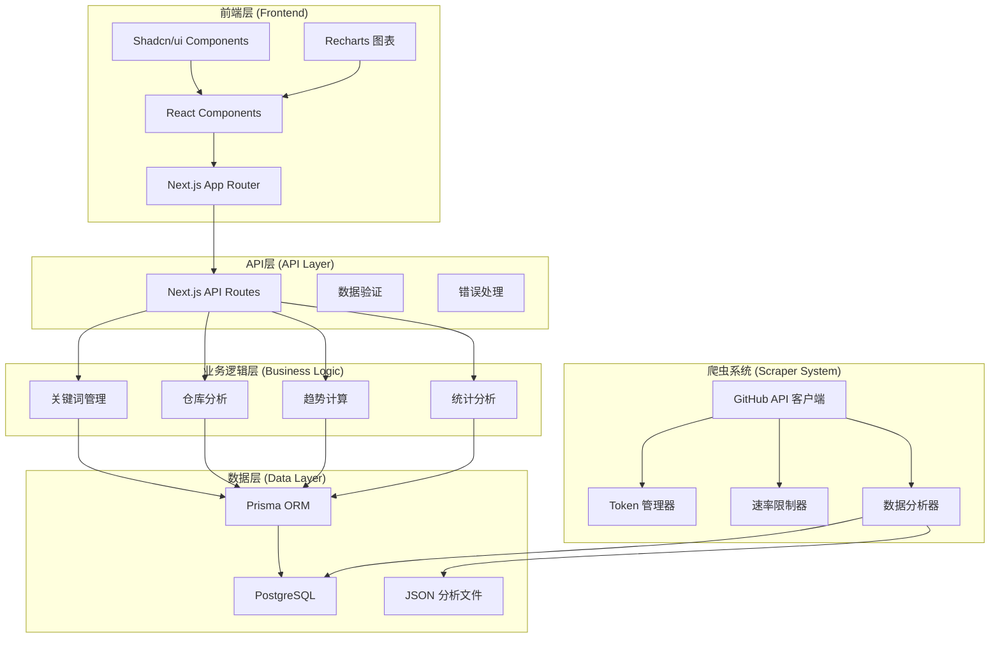
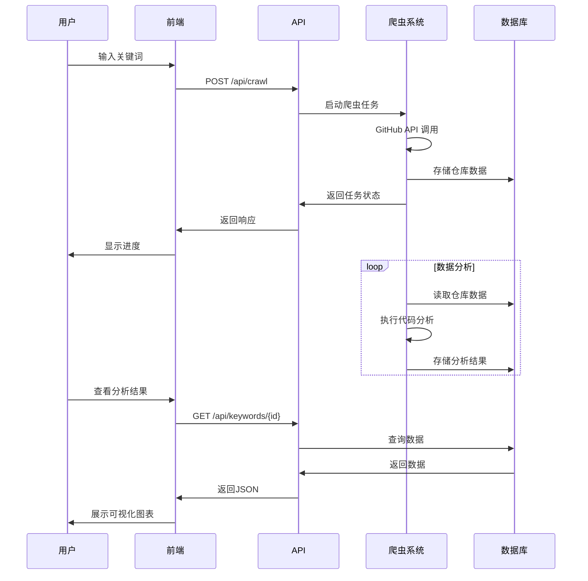

# 🏗️ SpiderGit - 项目架构文档

## 📋 概述

<div align="center">
  
</div>

SpiderGit 是一个现代化的全栈 GitHub 趋势分析系统，专注于自动抓取和分析GitHub上的热门仓库数据。项目采用 **Next.js 14** + **TypeScript** 作为前端，**Python 3.8+** 作为爬虫和数据分析引擎，**JSON文件存储** 作为轻量级数据层。

### 🎯 核心特性
- 🕷️ **智能爬虫系统**：GitHub Trending HTML解析 + REST API集成，多Token管理
- 📊 **实时数据Dashboard**：热门仓库展示、技术栈统计、趋势分析
- 📈 **多维度趋势分析**：日/周/月趋势可视化，时间序列数据追踪
- 🗓️ **日历热力图**：直观展示每日趋势变化和项目活跃度
- 🧩 **技术栈分析**：编程语言分布统计，技术趋势识别
- 🔄 **自动化数据收集**：定时任务调度，增量数据更新
- 💾 **轻量级存储**：JSON文件存储，无需数据库依赖
- 🎨 **现代化UI设计**：响应式布局，毛玻璃效果，渐变背景
- ⚡ **高性能架构**：API缓存，分页加载，组件懒加载
- 🔧 **开发者友好**：TypeScript支持，完整文档，易于部署

## 🗂️ 实际项目结构

### 📁 当前架构特点
- 采用 Next.js 14 App Router 架构
- 前端组件模块化设计
- Python 爬虫系统独立运行
- JSON文件存储，无数据库依赖
- 轻量级部署，易于维护

### 🎯 实际目录结构

```
SpiderGit/
├── 📁 docs/                          # 📚 项目文档
│   ├── ARCHITECTURE.md               # 系统架构文档
│   ├── MIGRATION_GUIDE.md            # 迁移指南
│   ├── QUICK_START.md                # 快速开始指南
│   └── TESTING.md                    # 测试指南
│
├── 📁 app/                           # 🎨 Next.js App Router
│   ├── api/                          # API 路由层
│   │   ├── trends/                   # 主趋势数据API
│   │   │   ├── route.ts             # 趋势数据接口
│   │   │   └── stats/               # 技术栈统计API
│   │   └── trending/                # 兼容性API路由
│   │       ├── monthly/             # 月度数据重定向
│   │       ├── calendar/            # 日历数据API
│   │       └── time-series/         # 时间序列API
│   ├── dashboard/                    # Dashboard页面
│   │   └── page.tsx                 # 热门仓库和技术栈概览
│   ├── trends/                       # 趋势分析页面
│   │   └── page.tsx                 # 完整趋势分析功能
│   ├── globals.css                   # 全局样式
│   ├── layout.tsx                    # 根布局组件
│   └── page.tsx                      # 首页介绍
│
├── 📁 src/                           # 🧩 前端源码模块
│   ├── components/                   # React组件库
│   │   ├── ui/                       # 基础UI组件 (Shadcn/ui)
│   │   │   ├── card.tsx             # 卡片组件
│   │   │   ├── button.tsx           # 按钮组件
│   │   │   ├── badge.tsx            # 徽章组件
│   │   │   ├── progress.tsx         # 进度条组件
│   │   │   ├── charts.tsx           # 图表组件
│   │   │   └── ...                  # 其他基础UI组件
│   │   ├── features/                 # 功能组件
│   │   │   ├── trending-hot-repositories.tsx    # 热门仓库展示
│   │   │   ├── tech-stats-overview.tsx          # 技术栈统计
│   │   │   ├── trending-calendar.tsx            # 日历热力图
│   │   │   ├── time-series-analysis.tsx         # 时间序列分析
│   │   │   ├── repository-card.tsx              # 仓库卡片
│   │   │   ├── enhanced-repository-card.tsx     # 增强仓库卡片
│   │   │   ├── trending-stats-panel.tsx         # 趋势统计面板
│   │   │   ├── trending-charts.tsx              # 趋势图表
│   │   │   ├── advanced-export.tsx              # 高级导出功能
│   │   │   ├── repository-list.tsx              # 仓库列表
│   │   │   ├── tag-analysis.tsx                 # 标签分析
│   │   │   ├── keyword-cloud.tsx                # 关键词云
│   │   │   └── enhanced-library-analysis.tsx    # 库分析
│   │   ├── charts/                   # 图表组件
│   │   │   └── charts-display.tsx    # 图表展示
│   │   ├── layout/                   # 布局组件
│   │   │   ├── navbar.tsx           # 导航栏
│   │   │   └── theme-provider.tsx   # 主题提供者
│   │   └── CrawlerMonitor.tsx        # 爬虫监控组件
│   └── lib/                          # 工具库
│       └── utils/                    # 通用工具函数
│
├── 📁 backend/                       # 🐍 Python后端系统
│   ├── scraper/                      # 爬虫核心模块
│   │   ├── core/                     # 核心组件
│   │   │   ├── api_client.py        # GitHub API客户端
│   │   │   └── token_manager.py     # Token管理器
│   │   ├── crawlers/                 # 爬虫实现
│   │   │   ├── github_trending_html.py  # HTML趋势爬虫
│   │   │   └── keyword_scraper.py       # 关键词搜索爬虫
│   │   ├── analyzers/                # 数据分析器
│   │   │   ├── code_analyzer.py     # 代码分析器
│   │   │   └── data_analysis.py     # 数据统计分析
│   │   ├── trending_manager.py       # 主趋势管理器
│   │   ├── time_series_trending_manager.py  # 时间序列管理器
│   │   └── scheduler.py             # 定时任务调度器
│   ├── requirements/                 # 依赖管理
│   │   ├── base.txt                 # 基础依赖
│   │   └── dev.txt                  # 开发依赖
│   ├── pyproject.toml               # Python项目配置
│   └── README.md                    # 后端文档
│
├── 📁 public/                        # 🗂️ 静态资源和数据存储
│   ├── logo.png                      # 项目Logo
│   ├── img/                          # 图片资源
│   └── trends/                       # 趋势数据存储
│       ├── data/                     # 主数据文件
│       │   └── trends.json          # 主趋势数据文件
│       ├── time_series/              # 时间序列数据
│       │   ├── daily/               # 日度数据
│       │   ├── weekly/              # 周度数据
│       │   └── monthly/             # 月度数据
│       └── backups/                 # 数据备份
│
├── 📁 components/                    # 🎨 Shadcn/ui组件库
│   └── ui/                          # 基础UI组件
│
├── 📁 docs/                         # 📚 项目文档
│   ├── ARCHITECTURE.md              # 系统架构文档
│   ├── MIGRATION_GUIDE.md           # 迁移指南
│   └── TESTING.md                   # 测试指南
│
├── 📄 配置文件                       # ⚙️ 项目配置
│   ├── package.json                 # Node.js项目配置
│   ├── tsconfig.json               # TypeScript配置
│   ├── tailwind.config.ts          # TailwindCSS配置
│   ├── next.config.js              # Next.js配置
│   ├── .env.example                # 环境变量示例
│   └── README.md                   # 项目说明文档
```
│
├── 📁 public/                        # 📦 静态资源和数据存储
│   ├── logo.png                      # 项目Logo
│   ├── img/                          # 图片资源
│   └── trends/                       # 趋势数据存储
│       ├── data/                     # 主数据文件
│       │   └── trends.json          # 主趋势数据文件
│       ├── time_series/              # 时间序列数据
│       │   ├── daily/               # 日度数据
│       │   ├── weekly/              # 周度数据
│       │   └── monthly/             # 月度数据
│       └── backups/                 # 数据备份
│
├── 📁 components/                    # 🎨 Shadcn/ui组件库
│   └── ui/                          # 基础UI组件
│
├── 📄 README.md                      # 项目说明
├── 📄 CHANGELOG.md                   # 更新日志
├── 📄 package.json                   # Node.js 依赖
├── 📄 next.config.js                 # Next.js 配置
├── 📄 tailwind.config.js             # Tailwind 配置
├── 📄 tsconfig.json                  # TypeScript 配置
├── 📄 postcss.config.js              # PostCSS 配置
├── 📄 components.json                # Shadcn/ui 配置
├── 📄 project-shell.ps1              # PowerShell 脚本
└── 📄 cleanup-maimai.js              # 清理脚本
```

## 🛠️ 技术栈详情

### 前端技术栈
- **框架**: Next.js 14 (App Router)
- **语言**: TypeScript
- **样式**: TailwindCSS + PostCSS
- **UI组件**: Shadcn/ui + Radix UI
- **图表**: Recharts
- **图标**: Lucide React
- **状态管理**: React Hooks + Context
- **主题**: next-themes (暗色模式支持)

### 后端技术栈
- **语言**: Python 3.8+
- **爬虫框架**: Requests + BeautifulSoup4 + lxml
- **异步支持**: aiohttp + asyncio-throttle
- **数据处理**: Pandas + NumPy
- **API客户端**: GitHub REST API
- **任务调度**: Schedule
- **配置管理**: python-dotenv + PyYAML
- **HTTP客户端**: urllib3

### 数据存储技术栈
- **存储方式**: JSON文件存储
- **数据结构**: 时间序列数据
- **备份策略**: 自动备份和版本管理
- **数据格式**: 标准化JSON格式
- **访问方式**: 文件系统直接访问

### 开发工具
- **包管理**: npm (前端) + pip (后端)
- **代码格式化**: Prettier (TypeScript)
- **代码检查**: ESLint (TypeScript)
- **类型检查**: TypeScript
- **构建工具**: Next.js + SWC
- **版本控制**: Git

## 🧩 组件架构

### 前端组件体系

#### 页面组件 (Pages)
```
app/
├── page.tsx                    # 首页 - 项目介绍和功能展示
├── dashboard/page.tsx          # Dashboard - 热门仓库和技术栈概览
├── trends/page.tsx            # Trends - 完整的趋势分析功能
└── keywords/page.tsx          # Keywords - 关键词搜索和分析
```

#### 功能组件 (Features)
- **Dashboard组件**:
  - `TrendingHotRepositories`: 热门仓库展示卡片
  - `TechStatsOverview`: 技术栈统计和分布图表

- **Trends组件**:
  - `RepositoryCard`: 基础仓库信息卡片
  - `EnhancedRepositoryCard`: 增强版仓库卡片
  - `TrendingStatsPanel`: 趋势统计面板
  - `TrendingCharts`: 趋势图表组件
  - `TrendingCalendar`: 日历热力图
  - `TimeSeriesAnalysis`: 时间序列分析图表
  - `AdvancedExport`: 高级数据导出功能

- **Keywords组件**:
  - `RepositoryList`: 仓库列表展示
  - `TagAnalysis`: 标签分析组件
  - `KeywordCloud`: 关键词云图
  - `EnhancedLibraryAnalysis`: 库依赖分析
  - `CrawlerMonitor`: 爬虫系统监控

#### 图表组件 (Charts)
- `ChartsDisplay`: 统一的图表展示组件，支持多种图表类型

#### 布局组件 (Layout)
- `Navbar`: 主导航栏，支持响应式设计
- `ThemeProvider`: 主题提供者，支持明暗模式切换

#### UI基础组件 (UI Components)
基于Shadcn/ui的组件库，包括：
- `Card`, `Button`, `Badge`, `Progress`
- `Dialog`, `Dropdown`, `Select`, `Input`
- `Table`, `Tabs`, `Tooltip`, `Skeleton`
- `Charts`, `RangeSlider`, `LoadingSkeleton`

## 🏗️ 系统架构

### 整体架构图



### 数据流架构



## 🧩 核心模块详解

### 1. 前端模块 (Frontend Modules)

#### App Router 结构
- **页面路由**: 基于文件系统的路由，支持动态路由和路由组
- **API路由**: 服务端API端点，处理数据请求和业务逻辑
- **布局系统**: 嵌套布局，支持全局和页面级布局
- **中间件**: 请求拦截和处理

#### 组件架构
- **UI组件** (`src/components/ui/`): 基础UI组件库
- **功能组件** (`src/components/features/`): 业务功能组件
- **图表组件** (`src/components/charts/`): 数据可视化组件
- **布局组件** (`src/components/layout/`): 页面布局组件

#### 状态管理
- **本地状态**: React useState 和 useReducer
- **服务端状态**: SWR 或 React Query (计划中)
- **全局状态**: React Context API
- **主题状态**: next-themes

### 2. 后端模块 (Backend Modules)

#### 爬虫系统 (`backend/scraper/`)
- **核心模块** (`core/`): Token管理、API客户端
- **爬虫实现** (`crawlers/`): 具体的爬虫逻辑
- **数据分析** (`analyzers/`): 代码分析和数据处理
- **任务调度** (`scheduler.py`): 定时任务管理

#### API客户端
- **GitHub API**: RESTful API调用
- **速率限制**: 请求频率控制
- **错误重试**: 自动重试机制
- **Token轮换**: 多Token负载均衡

#### 数据分析引擎
- **代码分析**: 语言检测、依赖分析
- **趋势计算**: 时间序列分析
- **统计分析**: 数据聚合和计算
- **报告生成**: JSON格式输出

### 3. 数据库模块 (Database Modules)

#### Prisma ORM
- **模式定义**: `database/prisma/schema.prisma`
- **迁移管理**: 数据库版本控制
- **查询构建**: 类型安全的查询
- **关系映射**: 表关系定义

#### 数据模型
- **Repository**: 仓库基本信息
- **Keyword**: 关键词管理
- **Language**: 编程语言统计
- **Library**: 库依赖分析
- **Trend**: 趋势数据

### 4. API模块 (API Modules)

#### RESTful API设计
- **资源导向**: 基于资源的URL设计
- **HTTP方法**: GET、POST、PUT、DELETE
- **状态码**: 标准HTTP状态码
- **错误处理**: 统一错误响应格式

#### API端点分类
- **数据查询**: `/api/stats`, `/api/repositories`
- **关键词管理**: `/api/keywords`
- **爬虫控制**: `/api/crawl`, `/api/analysis`
- **数据导出**: `/api/export`
- **趋势分析**: `/api/trending`

## 🚀 部署架构

### 开发环境
- **前端**: Next.js 开发服务器 (localhost:3000)
- **数据库**: 本地 PostgreSQL 实例
- **爬虫**: 本地 Python 脚本执行
- **文件存储**: 本地文件系统

### 生产环境建议
- **前端**: Vercel / Netlify 部署
- **数据库**: AWS RDS / Google Cloud SQL
- **爬虫**: Docker 容器 + 定时任务
- **文件存储**: AWS S3 / Google Cloud Storage
- **监控**: Sentry / DataDog
- **CDN**: CloudFlare / AWS CloudFront

### Docker 部署

```dockerfile
# Dockerfile 示例
FROM node:18-alpine AS frontend
WORKDIR /app
COPY package*.json ./
RUN npm ci --only=production
COPY . .
RUN npm run build

FROM python:3.11-slim AS backend
WORKDIR /app
COPY backend/requirements/ ./requirements/
RUN pip install -r requirements/base.txt
COPY backend/ .

FROM node:18-alpine AS production
WORKDIR /app
COPY --from=frontend /app/.next ./.next
COPY --from=frontend /app/public ./public
COPY --from=frontend /app/package*.json ./
COPY --from=backend /app ./backend
RUN npm ci --only=production
EXPOSE 3000
CMD ["npm", "start"]
```

## ⚡ 性能优化

### 前端优化
- **代码分割**: Next.js 自动代码分割
- **图片优化**: Next.js Image 组件
- **缓存策略**: SWR 数据缓存
- **懒加载**: React.lazy + Suspense
- **Bundle 分析**: @next/bundle-analyzer

### 后端优化
- **数据库索引**: 关键字段建立索引
- **连接池**: PostgreSQL 连接池管理
- **缓存层**: Redis 缓存热点数据
- **异步处理**: 爬虫任务异步执行
- **批量操作**: 数据库批量插入/更新

### 爬虫优化
- **并发控制**: 限制并发请求数量
- **速率限制**: 遵守 GitHub API 限制
- **错误重试**: 指数退避重试策略
- **Token 轮换**: 多 Token 负载均衡
- **增量更新**: 只更新变化的数据

## 🔧 监控与维护

### 应用监控
- **性能监控**: 响应时间、吞吐量
- **错误监控**: 异常捕获和报告
- **资源监控**: CPU、内存、磁盘使用
- **业务监控**: 爬虫成功率、数据质量

### 日志管理
- **结构化日志**: JSON 格式日志
- **日志级别**: DEBUG、INFO、WARN、ERROR
- **日志轮转**: 按大小和时间轮转
- **集中收集**: ELK Stack / Fluentd

### 备份策略
- **数据库备份**: 定期全量和增量备份
- **文件备份**: 分析结果文件备份
- **配置备份**: 环境配置和密钥备份
- **恢复测试**: 定期恢复测试

## 🔐 安全考虑

### 数据安全
- **敏感信息**: 环境变量存储密钥
- **数据加密**: 传输和存储加密
- **访问控制**: API 访问权限控制
- **审计日志**: 操作审计记录

### 网络安全
- **HTTPS**: 强制 HTTPS 访问
- **CORS**: 跨域请求控制
- **CSP**: 内容安全策略
- **Rate Limiting**: 请求频率限制

### 依赖安全
- **漏洞扫描**: 定期依赖漏洞扫描
- **版本管理**: 及时更新安全补丁
- **许可证检查**: 开源许可证合规
- **供应链安全**: 依赖来源验证

## 📈 扩展性设计

### 水平扩展
- **无状态设计**: 应用层无状态
- **负载均衡**: 多实例负载均衡
- **数据库分片**: 按关键词或时间分片
- **缓存分布**: 分布式缓存集群

### 垂直扩展
- **资源优化**: CPU 和内存优化
- **数据库优化**: 查询和索引优化
- **存储优化**: 数据压缩和归档
- **网络优化**: CDN 和带宽优化

### 功能扩展
- **多数据源**: 支持更多代码托管平台
- **实时分析**: WebSocket 实时数据推送
- **机器学习**: 趋势预测和推荐算法
- **API 网关**: 统一 API 管理和认证
