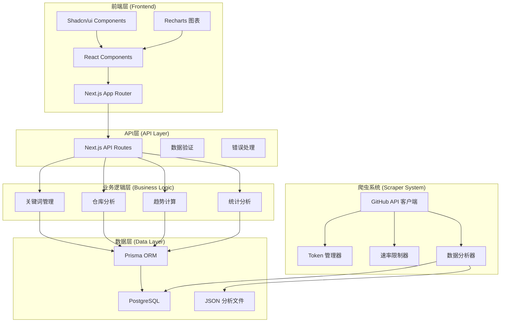
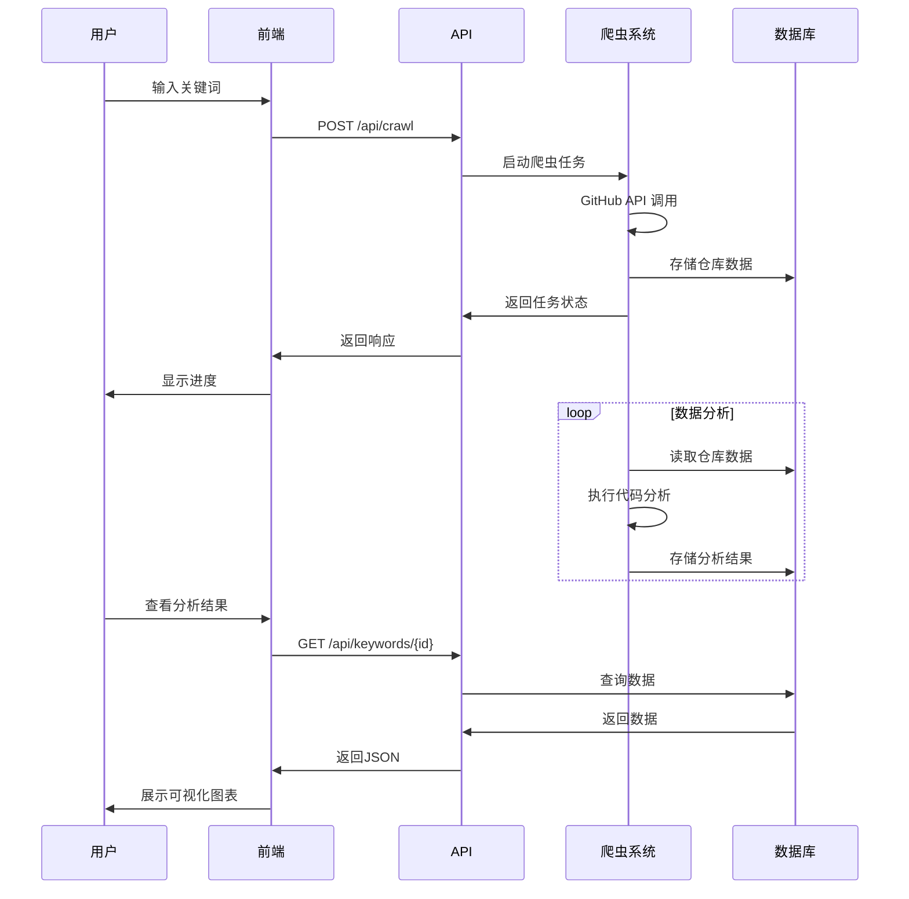

# 🏗️ SpiderGit - 项目架构文档

## 📋 概述

SpiderGit 是一个现代化的全栈 GitHub 趋势分析系统，用于抓取、分析和可视化 GitHub 趋势数据。项目采用 **Next.js 14** + **TypeScript** 作为前端，**Python 3.12** 作为爬虫和数据分析引擎，**PostgreSQL** + **Prisma** 作为数据层。

### 🎯 核心特性
- 🕷️ **智能爬虫系统**：GitHub API 集成、关键词搜索、数据采集
- 📊 **数据分析引擎**：仓库分析、趋势计算、标签分析、星标统计
- 🎨 **现代化 UI**：响应式设计、暗色模式、实时图表、数据可视化
- 🤖 **CI/CD 集成**：自动化测试、代码质量检查、安全扫描
- 🔍 **关键词分析**：按技术关键词抓取并分析GitHub仓库
- 📈 **多维度趋势**：日、周、月趋势可视化
- 🧩 **语言分布分析**：直观展示不同编程语言的流行度
- 📚 **库与依赖分析**：分析项目中使用的热门库和框架
- 🧪 **完整测试体系**：前后端测试、CI/CD、覆盖率报告
- 🔧 **开发者友好**：自动化工具、详细文档、跨平台支持

## 🗂️ 实际项目结构

### 📁 当前架构特点
- 采用 Next.js 13 App Router 架构
- 前端组件模块化设计
- Python 后端独立模块
- 完整的测试体系
- 自动化工具支持

### 🎯 实际目录结构

```
github-trending-scraper/
├── 📁 docs/                          # 📚 项目文档
│   ├── ARCHITECTURE.md               # 架构文档
│   ├── ARCHITECTURE_COMPARISON.md    # 架构对比
│   ├── MIGRATION_GUIDE.md            # 迁移指南
│   ├── QUICK_START.md                # 快速开始
│   └── TESTING.md                    # 测试指南
│
├── 📁 app/                           # 🎨 Next.js App Router
│   ├── about/                        # 关于页面
│   ├── admin/                        # 管理页面
│   │   └── cleanup/                  # 数据清理
│   ├── api/                          # API 路由
│   │   ├── analysis/                 # 数据分析API
│   │   ├── crawl/                    # 爬虫控制API
│   │   ├── export/                   # 数据导出API
│   │   ├── keywords/                 # 关键词API
│   │   ├── libraries/                # 库分析API
│   │   ├── repositories/             # 仓库API
│   │   ├── stats/                    # 统计API
│   │   └── trending/                 # 趋势API
│   ├── dashboard/                    # 仪表盘页面
│   ├── keywords/                     # 关键词页面
│   │   └── [id]/                     # 关键词详情页
│   ├── daily/                        # 日趋势页面
│   ├── weekly/                       # 周趋势页面
│   ├── monthly/                      # 月趋势页面
│   ├── globals.css                   # 全局样式
│   ├── layout.tsx                    # 根布局
│   └── page.tsx                      # 首页
│
├── 📁 src/                           # 🧩 前端源码模块
│   ├── components/                   # UI 组件
│   │   ├── ui/                       # 基础 UI 组件 (Shadcn/ui)
│   │   ├── charts/                   # 图表组件
│   │   ├── features/                 # 功能组件
│   │   └── layout/                   # 布局组件
│   ├── lib/                          # 工具库
│   │   ├── db/                       # 数据库工具
│   │   ├── api/                      # API 工具
│   │   └── utils/                    # 通用工具
│   └── types/                        # TypeScript 类型定义
│       ├── api.ts                    # API 类型
│       ├── database.ts               # 数据库类型
│       └── components.ts             # 组件类型
│
├── 📁 backend/                       # 🐍 Python 后端
│   ├── scraper/                      # 爬虫系统
│   │   ├── core/                     # 核心模块
│   │   │   ├── token_manager.py      # GitHub Token 管理
│   │   │   └── api_client.py         # GitHub API 客户端
│   │   ├── crawlers/                 # 爬虫实现
│   │   │   └── trending_crawler.py   # 趋势爬虫
│   │   ├── analyzers/                # 数据分析器
│   │   │   ├── code_analyzer.py      # 代码分析器
│   │   │   └── data_analysis.py      # 数据统计分析
│   │   ├── keyword_scraper.py        # 关键词爬虫
│   │   ├── main.py                   # 主程序入口
│   │   ├── scheduler.py              # 定时任务调度
│   │   ├── mock_data_generator.py    # 模拟数据生成器
│   │   └── requirements.txt          # 爬虫依赖
│   │
│   ├── requirements/                 # 依赖管理
│   │   ├── base.txt                  # 基础依赖
│   │   └── dev.txt                   # 开发依赖
│   │
│   ├── pyproject.toml                # Python 项目配置
│   ├── README.md                     # 后端说明文档
│   └── __init__.py                   # Python 包初始化
│
├── 📁 tests/                         # 🧪 测试文件
│   ├── frontend/                     # 前端测试
│   │   ├── __tests__/                # Jest 测试文件
│   │   │   ├── api/                  # API 测试
│   │   │   └── components/           # 组件测试
│   │   ├── jest.config.js            # Jest 配置
│   │   └── jest.setup.js             # Jest 设置
│   │
│   └── backend/                      # 后端测试
│       └── test_*.py                 # Python 测试文件
│
├── 📁 tools/                         # 🔧 开发工具
│   └── scripts/                      # 脚本文件
│       ├── setup/                    # 环境设置脚本
│       ├── testing/                  # 测试脚本
│       ├── cleanup/                  # 清理脚本
│       └── validation/               # 验证脚本
│
├── 📁 database/                      # 🗄️ 数据库
│   └── prisma/                       # Prisma 配置
│       ├── schema.prisma             # 数据库模式
│       ├── schema-compatible.prisma  # 兼容模式
│       └── seed.ts                   # 数据种子
│
├── 📁 public/                        # 📦 静态资源
│   ├── analytics/                    # 分析结果文件
│   ├── img/                          # 图片资源
│   └── logo.png                      # 项目Logo
│
├── 📁 config/                        # ⚙️ 配置文件
│   └── next.config.js                # Next.js 配置
│
├── 📁 cankao/                        # 📚 参考代码
│   ├── code_analyzer.py              # 代码分析参考
│   ├── data_analysis.py              # 数据分析参考
│   ├── keyword_scraper.py            # 关键词爬虫参考
│   └── main.py                       # 主程序参考
│
├── 📁 tmp/                           # 🗂️ 临时文件
│
├── 📄 README.md                      # 项目说明
├── 📄 CHANGELOG.md                   # 更新日志
├── 📄 package.json                   # Node.js 依赖
├── 📄 next.config.js                 # Next.js 配置
├── 📄 tailwind.config.js             # Tailwind 配置
├── 📄 tsconfig.json                  # TypeScript 配置
├── 📄 postcss.config.js              # PostCSS 配置
├── 📄 components.json                # Shadcn/ui 配置
├── 📄 project-shell.ps1              # PowerShell 脚本
└── 📄 cleanup-maimai.js              # 清理脚本
```

## 🛠️ 技术栈详情

### 前端技术栈
- **框架**: Next.js 13.5.6 (App Router)
- **语言**: TypeScript
- **样式**: TailwindCSS + PostCSS
- **UI组件**: Shadcn/ui + Radix UI
- **图表**: Recharts
- **图标**: Lucide React
- **状态管理**: React Hooks + Context
- **主题**: next-themes (暗色模式支持)

### 后端技术栈
- **语言**: Python 3.8+
- **爬虫框架**: Requests + BeautifulSoup4
- **异步支持**: aiohttp + asyncio-throttle
- **数据处理**: Pandas + NumPy
- **API客户端**: GitHub REST API
- **任务调度**: Schedule
- **配置管理**: python-dotenv + PyYAML

### 数据库技术栈
- **数据库**: PostgreSQL
- **ORM**: Prisma
- **连接器**: psycopg2-binary
- **迁移**: Prisma Migrate
- **种子数据**: TypeScript seed 脚本

### 开发工具
- **包管理**: npm (前端) + pip (后端)
- **代码格式化**: Black (Python) + Prettier (TypeScript)
- **代码检查**: Flake8 (Python) + ESLint (TypeScript)
- **类型检查**: MyPy (Python) + TypeScript
- **测试框架**: Jest (前端) + pytest (后端)
- **构建工具**: Next.js + SWC

## 🏗️ 系统架构

### 整体架构图



### 数据流架构



## 🧩 核心模块详解

### 1. 前端模块 (Frontend Modules)

#### App Router 结构
- **页面路由**: 基于文件系统的路由，支持动态路由和路由组
- **API路由**: 服务端API端点，处理数据请求和业务逻辑
- **布局系统**: 嵌套布局，支持全局和页面级布局
- **中间件**: 请求拦截和处理

#### 组件架构
- **UI组件** (`src/components/ui/`): 基础UI组件库
- **功能组件** (`src/components/features/`): 业务功能组件
- **图表组件** (`src/components/charts/`): 数据可视化组件
- **布局组件** (`src/components/layout/`): 页面布局组件

#### 状态管理
- **本地状态**: React useState 和 useReducer
- **服务端状态**: SWR 或 React Query (计划中)
- **全局状态**: React Context API
- **主题状态**: next-themes

### 2. 后端模块 (Backend Modules)

#### 爬虫系统 (`backend/scraper/`)
- **核心模块** (`core/`): Token管理、API客户端
- **爬虫实现** (`crawlers/`): 具体的爬虫逻辑
- **数据分析** (`analyzers/`): 代码分析和数据处理
- **任务调度** (`scheduler.py`): 定时任务管理

#### API客户端
- **GitHub API**: RESTful API调用
- **速率限制**: 请求频率控制
- **错误重试**: 自动重试机制
- **Token轮换**: 多Token负载均衡

#### 数据分析引擎
- **代码分析**: 语言检测、依赖分析
- **趋势计算**: 时间序列分析
- **统计分析**: 数据聚合和计算
- **报告生成**: JSON格式输出

### 3. 数据库模块 (Database Modules)

#### Prisma ORM
- **模式定义**: `database/prisma/schema.prisma`
- **迁移管理**: 数据库版本控制
- **查询构建**: 类型安全的查询
- **关系映射**: 表关系定义

#### 数据模型
- **Repository**: 仓库基本信息
- **Keyword**: 关键词管理
- **Language**: 编程语言统计
- **Library**: 库依赖分析
- **Trend**: 趋势数据

### 4. API模块 (API Modules)

#### RESTful API设计
- **资源导向**: 基于资源的URL设计
- **HTTP方法**: GET、POST、PUT、DELETE
- **状态码**: 标准HTTP状态码
- **错误处理**: 统一错误响应格式

#### API端点分类
- **数据查询**: `/api/stats`, `/api/repositories`
- **关键词管理**: `/api/keywords`
- **爬虫控制**: `/api/crawl`, `/api/analysis`
- **数据导出**: `/api/export`
- **趋势分析**: `/api/trending`

## 🚀 部署架构

### 开发环境
- **前端**: Next.js 开发服务器 (localhost:3000)
- **数据库**: 本地 PostgreSQL 实例
- **爬虫**: 本地 Python 脚本执行
- **文件存储**: 本地文件系统

### 生产环境建议
- **前端**: Vercel / Netlify 部署
- **数据库**: AWS RDS / Google Cloud SQL
- **爬虫**: Docker 容器 + 定时任务
- **文件存储**: AWS S3 / Google Cloud Storage
- **监控**: Sentry / DataDog
- **CDN**: CloudFlare / AWS CloudFront

### Docker 部署

```dockerfile
# Dockerfile 示例
FROM node:18-alpine AS frontend
WORKDIR /app
COPY package*.json ./
RUN npm ci --only=production
COPY . .
RUN npm run build

FROM python:3.11-slim AS backend
WORKDIR /app
COPY backend/requirements/ ./requirements/
RUN pip install -r requirements/base.txt
COPY backend/ .

FROM node:18-alpine AS production
WORKDIR /app
COPY --from=frontend /app/.next ./.next
COPY --from=frontend /app/public ./public
COPY --from=frontend /app/package*.json ./
COPY --from=backend /app ./backend
RUN npm ci --only=production
EXPOSE 3000
CMD ["npm", "start"]
```

## ⚡ 性能优化

### 前端优化
- **代码分割**: Next.js 自动代码分割
- **图片优化**: Next.js Image 组件
- **缓存策略**: SWR 数据缓存
- **懒加载**: React.lazy + Suspense
- **Bundle 分析**: @next/bundle-analyzer

### 后端优化
- **数据库索引**: 关键字段建立索引
- **连接池**: PostgreSQL 连接池管理
- **缓存层**: Redis 缓存热点数据
- **异步处理**: 爬虫任务异步执行
- **批量操作**: 数据库批量插入/更新

### 爬虫优化
- **并发控制**: 限制并发请求数量
- **速率限制**: 遵守 GitHub API 限制
- **错误重试**: 指数退避重试策略
- **Token 轮换**: 多 Token 负载均衡
- **增量更新**: 只更新变化的数据

## 🔧 监控与维护

### 应用监控
- **性能监控**: 响应时间、吞吐量
- **错误监控**: 异常捕获和报告
- **资源监控**: CPU、内存、磁盘使用
- **业务监控**: 爬虫成功率、数据质量

### 日志管理
- **结构化日志**: JSON 格式日志
- **日志级别**: DEBUG、INFO、WARN、ERROR
- **日志轮转**: 按大小和时间轮转
- **集中收集**: ELK Stack / Fluentd

### 备份策略
- **数据库备份**: 定期全量和增量备份
- **文件备份**: 分析结果文件备份
- **配置备份**: 环境配置和密钥备份
- **恢复测试**: 定期恢复测试

## 🔐 安全考虑

### 数据安全
- **敏感信息**: 环境变量存储密钥
- **数据加密**: 传输和存储加密
- **访问控制**: API 访问权限控制
- **审计日志**: 操作审计记录

### 网络安全
- **HTTPS**: 强制 HTTPS 访问
- **CORS**: 跨域请求控制
- **CSP**: 内容安全策略
- **Rate Limiting**: 请求频率限制

### 依赖安全
- **漏洞扫描**: 定期依赖漏洞扫描
- **版本管理**: 及时更新安全补丁
- **许可证检查**: 开源许可证合规
- **供应链安全**: 依赖来源验证

## 📈 扩展性设计

### 水平扩展
- **无状态设计**: 应用层无状态
- **负载均衡**: 多实例负载均衡
- **数据库分片**: 按关键词或时间分片
- **缓存分布**: 分布式缓存集群

### 垂直扩展
- **资源优化**: CPU 和内存优化
- **数据库优化**: 查询和索引优化
- **存储优化**: 数据压缩和归档
- **网络优化**: CDN 和带宽优化

### 功能扩展
- **多数据源**: 支持更多代码托管平台
- **实时分析**: WebSocket 实时数据推送
- **机器学习**: 趋势预测和推荐算法
- **API 网关**: 统一 API 管理和认证
