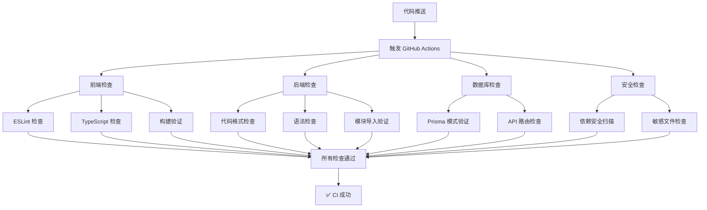

# 🧪 GitHub趋势爬虫平台 - 测试指南

<div align="center">
  
  <h1>测试指南</h1>
  <p><strong>完整的测试策略和执行指南</strong></p>
</div>

本文档详细说明GitHub趋势爬虫平台的测试方法，包括功能测试、API测试和系统验证。

## 📋 目录

- [测试概述](#测试概述)
- [功能测试](#功能测试)
- [API测试](#api测试)
- [系统验证](#系统验证)
- [测试执行指南](#测试执行指南)
- [故障排除](#故障排除)

## 🎯 测试概述

GitHub趋势爬虫平台采用**全面测试验证体系**，确保系统功能完整性和稳定性：

### 🏗️ 测试架构

```
测试体系
├── 🤖 CI/CD 自动化测试
│   ├── GitHub Actions 工作流
│   ├── 代码质量检查
│   ├── 安全性扫描
│   └── 构建验证
├── 🎨 前端测试 (Jest + React Testing Library)
│   ├── 组件单元测试
│   ├── API 路由测试
│   ├── 工具函数测试
│   └── 用户交互测试
├── 🐍 后端测试 (Python)
│   ├── 爬虫功能测试
│   ├── 数据分析测试
│   ├── 代码质量检查
│   └── 模块导入验证
└── 🔗 集成测试
    ├── API 端点测试
    ├── 数据库连接测试
    └── 跨系统集成验证
```

### 📊 当前测试状态

- ✅ **CI/CD 流水线**：3个工作流配置完成
- ✅ **前端测试框架**：Jest + React Testing Library 已配置
- ✅ **后端代码检查**：Flake8 + Black + isort 已集成
- ✅ **安全性扫描**：npm audit + safety 已配置
- 🔄 **测试用例**：基础测试用例已创建，持续完善中

## 🤖 CI/CD 测试流水线

项目配置了完整的 GitHub Actions 工作流，确保代码质量和系统稳定性。

### 📋 工作流概览

#### 1. **完整 CI 流水线** (`.github/workflows/ci.yml`)

**触发条件**：推送到 `main`、`develop` 分支或创建 PR

**包含的检查**：
- 🎨 **前端质量检查**：ESLint、TypeScript 类型检查、构建验证
- 🐍 **Python 代码检查**：Black、isort、Flake8、模块导入验证
- 🗄️ **API 和数据库检查**：Prisma 模式验证、API 路由检查
- 🔒 **安全性检查**：npm audit、Python safety、敏感文件检查

#### 2. **简化 CI 流水线** (`.github/workflows/simple-ci.yml`)

**触发条件**：推送到 `main` 分支或创建 PR

**适用场景**：个人开发、快速验证

**包含的检查**：
- 基础代码格式检查
- 构建验证
- 非阻塞安全检查

#### 3. **CodeQL 安全扫描** (`.github/workflows/codeql.yml`)

**功能**：自动化代码安全漏洞检测

### 🚀 CI 执行流程



### 📊 CI 检查详情

#### 前端检查项目
- **ESLint**：代码风格和潜在问题检查
- **TypeScript**：类型安全检查
- **构建测试**：确保应用可以正常构建
- **依赖安全**：npm audit 检查已知漏洞

#### 后端检查项目
- **Black**：Python 代码格式化检查
- **isort**：导入语句排序检查
- **Flake8**：语法和风格检查
- **模块导入**：验证核心模块可正常导入
- **安全扫描**：safety 检查 Python 依赖漏洞

#### 数据库和 API 检查
- **Prisma 验证**：数据库模式有效性检查
- **API 路由检查**：验证关键 API 端点文件存在
- **数据库连接**：PostgreSQL 服务可用性测试

## 🎨 前端测试

### 📦 测试环境配置

**依赖包：**
```json
{
  "@testing-library/jest-dom": "^6.6.3",
  "@testing-library/react": "^16.1.0",
  "@testing-library/user-event": "^14.5.2",
  "jest": "^29.7.0",
  "jest-environment-jsdom": "^29.7.0"
}
```

**配置文件：**
- `jest.config.js`：主配置文件
- `jest.setup.js`：测试环境设置

### 🚀 运行前端测试

```bash
# 运行所有前端测试
npm run test

# 监听模式（开发时使用）
npm run test:watch

# 生成覆盖率报告
npm run test:coverage

# 运行特定测试文件
npm test -- components/navbar.test.tsx

# 运行特定测试套件
npm test -- --testNamePattern="Navbar"
```

### 📊 测试覆盖率

目标覆盖率：
- **语句覆盖率**：≥ 80%
- **分支覆盖率**：≥ 75%
- **函数覆盖率**：≥ 85%
- **行覆盖率**：≥ 80%

### 🧪 测试示例

**组件测试示例：**
```typescript
// __tests__/components/navbar.test.tsx
import { render, screen } from '@testing-library/react'
import Navbar from '@/components/navbar'

describe('Navbar', () => {
  it('renders navigation links', () => {
    render(<Navbar />)
    expect(screen.getByText('Dashboard')).toBeInTheDocument()
    expect(screen.getByText('Keywords')).toBeInTheDocument()
  })
})
```

## 🐍 后端测试

### 📦 当前测试配置

**代码质量工具：**
```txt
flake8        # 语法和风格检查
black         # 代码格式化
isort         # 导入语句排序
safety        # 安全漏洞检查
```

**核心模块：**
- `backend/scraper/crawlers/keyword_scraper.py` - 关键词爬虫
- `backend/scraper/analyzers/data_analysis.py` - 数据分析器
- `backend/scraper/core/` - 核心功能模块
- `backend/scraper/crawlers/` - 爬虫实现

### 🚀 运行后端检查

```bash
# 进入后端目录
cd backend/scraper

# 代码格式检查
black --check . --diff

# 导入排序检查
isort --check-only . --diff

# 语法和风格检查
flake8 . --max-line-length=88 --extend-ignore=E203,W503,F401

# 安全漏洞检查
pip install safety
safety check -r requirements.txt

# 验证核心模块导入
python -c "import keyword_scraper; print('✅ keyword_scraper 模块正常')"
python -c "from analyzers import data_analysis; print('✅ data_analysis 模块正常')"
```

### 🧪 代码质量标准

**Python 代码规范：**
- **最大行长度**：88 字符
- **导入排序**：标准库 → 第三方库 → 本地模块
- **代码格式**：Black 自动格式化
- **忽略规则**：E203, W503, F401（与 Black 兼容）

**检查通过标准：**
- ✅ Flake8 无语法错误
- ✅ Black 格式检查通过
- ✅ isort 导入排序正确
- ✅ 核心模块可正常导入
- ✅ 无高危安全漏洞

## � 测试执行指南

### 📋 本地开发测试

**快速检查（推荐）：**
```bash
# 前端快速检查
npm run lint
npm run type-check
npm run build

# 后端快速检查
cd backend/scraper
flake8 . --max-line-length=88 --extend-ignore=E203,W503,F401
python -c "import keyword_scraper; print('✅ 模块导入正常')"
```

**完整测试：**
```bash
# 前端完整测试
npm ci
npm run test
npm run test:coverage

# 后端完整检查
cd backend/scraper
pip install -r requirements.txt
black --check . --diff
isort --check-only . --diff
flake8 . --max-line-length=88 --extend-ignore=E203,W503,F401
safety check -r requirements.txt
```

### 🤖 CI/CD 触发测试

**自动触发：**
- 推送到 `main` 或 `develop` 分支
- 创建或更新 Pull Request
- 定期安全扫描（CodeQL）

**手动触发：**
```bash
# 在 GitHub 仓库页面
Actions → 选择工作流 → Run workflow
```

### 📊 测试结果查看

**GitHub Actions：**
1. 进入仓库 → Actions 标签页
2. 选择对应的工作流运行
3. 查看各个 Job 的执行结果
4. 点击失败的步骤查看详细错误信息

**本地测试结果：**
```bash
# 前端测试覆盖率报告
npm run test:coverage
# 查看 coverage/lcov-report/index.html

# 后端代码质量报告
flake8 . --format=html --htmldir=flake8-report
# 查看 flake8-report/index.html
```

## �🔗 集成测试

### 🌐 API 集成测试

测试前后端 API 集成：

```typescript
// __tests__/api/integration.test.ts
describe('API Integration', () => {
  it('fetches trending repositories', async () => {
    const response = await fetch('/api/trending')
    expect(response.status).toBe(200)
    
    const data = await response.json()
    expect(data).toHaveProperty('repositories')
  })
})
```

### 🗄️ 数据库集成测试

```python
# scraper/tests/test_database_integration.py
@pytest.mark.integration
def test_database_connection():
    """测试数据库连接和基本操作"""
    # 测试数据库连接
    # 测试数据插入和查询
    pass
```

## 🤖 CI/CD 测试

### 📋 GitHub Actions 工作流

```yaml
# .github/workflows/test.yml
name: 测试流水线

on: [push, pull_request]

jobs:
  frontend-tests:
    runs-on: ubuntu-latest
    steps:
      - uses: actions/checkout@v4
      - uses: actions/setup-node@v4
        with:
          node-version: '18'
      - run: npm ci
      - run: npm run test:coverage
      
  backend-tests:
    runs-on: ubuntu-latest
    steps:
      - uses: actions/checkout@v4
      - uses: actions/setup-python@v4
        with:
          python-version: '3.12'
      - run: cd scraper && pip install -r requirements-dev.txt
      - run: cd scraper && python -m pytest --cov=.
```

### 🔍 代码质量检查

```yaml
  code-quality:
    runs-on: ubuntu-latest
    steps:
      - name: 前端代码检查
        run: |
          npm run lint
          npm run type-check
          
      - name: 后端代码检查
        run: |
          cd scraper
          flake8 .
          black --check .
          mypy .
```

## 📋 测试最佳实践

### ✅ 前端测试最佳实践

1. **组件测试**：
   - 测试用户交互，不测试实现细节
   - 使用 `screen.getByRole()` 而不是 `getByTestId()`
   - 模拟用户行为，不直接调用组件方法

2. **API 测试**：
   - 模拟外部依赖
   - 测试错误处理
   - 验证响应格式

3. **工具函数测试**：
   - 测试边界条件
   - 测试错误输入
   - 保持测试简单和快速

### ✅ 后端代码质量最佳实践

1. **代码格式**：
   - 使用 Black 自动格式化，保持一致性
   - 遵循 PEP 8 规范，最大行长度 88 字符
   - 使用 isort 管理导入语句排序

2. **代码质量**：
   - 定期运行 Flake8 检查语法和风格
   - 避免未使用的导入和变量
   - 保持函数和类的复杂度适中

3. **安全性**：
   - 定期使用 safety 检查依赖漏洞
   - 不在代码中硬编码敏感信息
   - 使用环境变量管理配置

4. **模块设计**：
   - 保持模块职责单一
   - 确保核心模块可独立导入
   - 使用清晰的命名约定

## 🚨 故障排除

### 常见 CI/CD 问题

**问题 1: GitHub Actions 构建失败**
```
Error: Process completed with exit code 1
```

**解决方案：**
1. 检查 `package.json` 中的脚本命令是否正确
2. 确保所有依赖都在 `package.json` 中声明
3. 检查环境变量配置是否完整

**问题 2: Python 模块导入失败**
```
ModuleNotFoundError: No module named 'keyword_scraper'
```

**解决方案：**
```bash
# 确保在正确的目录下运行
cd backend/scraper
python -c "import keyword_scraper"

# 检查文件路径和模块结构
ls -la *.py
```

**问题 3: 代码格式检查失败**
```
would reformat xxx.py
```

**解决方案：**
```bash
# 自动修复格式问题
cd backend/scraper
black .
isort .

# 然后重新提交
git add .
git commit -m "fix: 修复代码格式"
```

### 常见前端问题

**问题 1: TypeScript 类型错误**
```
Type 'string' is not assignable to type 'number'
```

**解决方案：**
```bash
# 运行类型检查查看详细错误
npm run type-check

# 修复类型定义
# 在 src/types/ 目录下更新类型定义
```

**问题 2: ESLint 规则冲突**
```
Parsing error: Unexpected token
```

**解决方案：**
```bash
# 检查 ESLint 配置
npm run lint -- --debug

# 自动修复可修复的问题
npm run lint -- --fix
```

## 📊 测试报告和监控

### 📈 GitHub Actions 报告

**查看测试结果：**
1. 进入 GitHub 仓库
2. 点击 "Actions" 标签页
3. 选择对应的工作流运行
4. 查看各个 Job 的执行状态

**测试状态徽章：**
```markdown

```

### 📋 本地测试报告

**前端测试覆盖率：**
```bash
npm run test:coverage
# 查看 coverage/lcov-report/index.html
```

**后端代码质量报告：**
```bash
cd backend/scraper
flake8 . --format=html --htmldir=flake8-report
# 查看 flake8-report/index.html
```

## 🎯 测试策略

### 🔄 质量保证金字塔

```
           /\
          /  \
         / 安全 \      ← 安全扫描和漏洞检测
        /______\
       /        \
      / 集成测试  \     ← API 和数据库集成
     /__________\
    /            \
   / 代码质量检查  \    ← 格式、语法、风格
  /______________\
 /                \
/ 单元测试和构建验证 \   ← 基础功能验证
/__________________\
```

### 📅 测试执行策略

- **开发时**：运行快速检查（lint + type-check）
- **提交前**：运行完整本地测试
- **推送时**：自动触发 CI/CD 流水线
- **发布前**：确保所有 CI 检查通过

### 🎯 质量目标

- ✅ **CI 通过率**：≥ 95%
- ✅ **代码覆盖率**：前端 ≥ 80%，后端代码质量 100%
- ✅ **安全漏洞**：0 个高危漏洞
- ✅ **构建成功率**：100%

---

通过这个完整的测试和质量保证体系，SpiderGit 项目确保了代码质量、系统稳定性和安全性。每次代码变更都经过严格的自动化检查，为项目的持续发展提供了坚实的基础。
